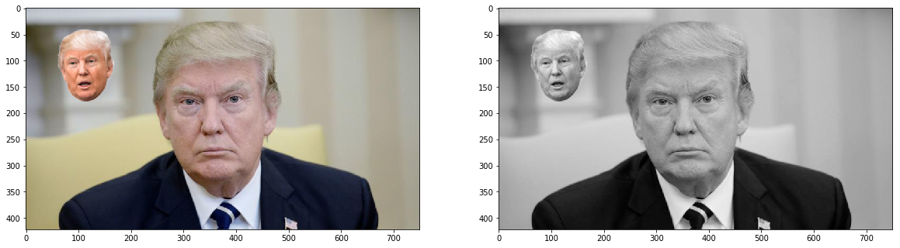
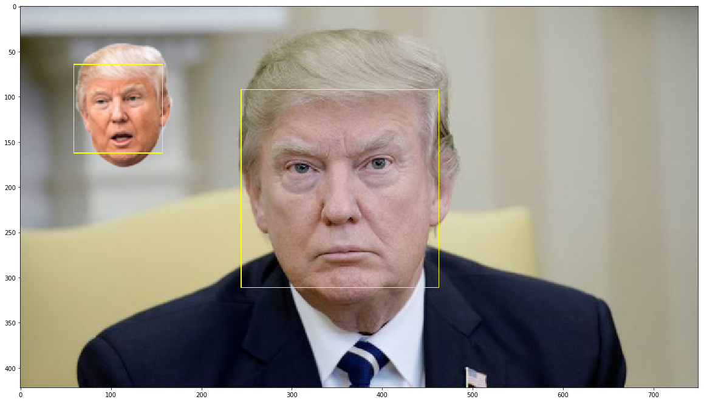
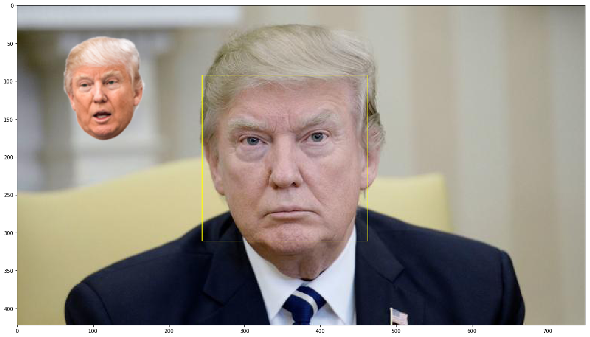
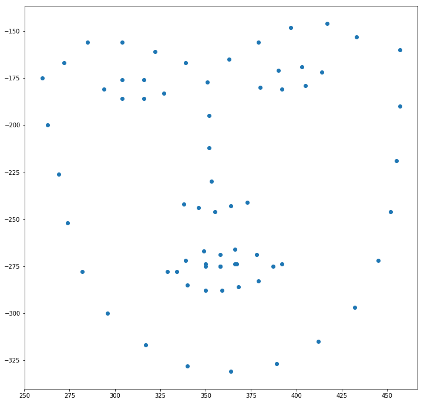
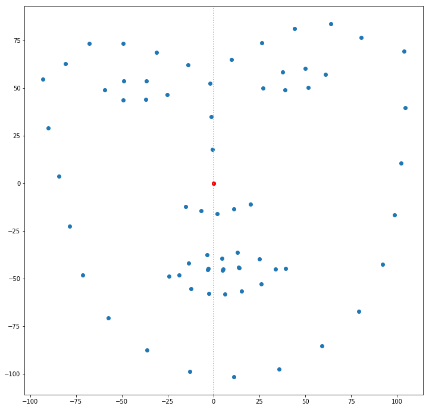
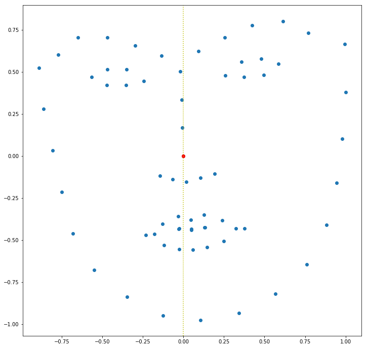
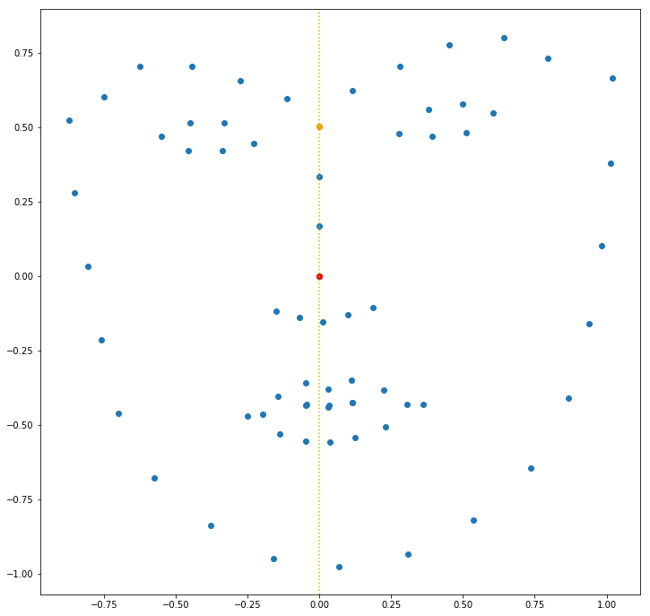
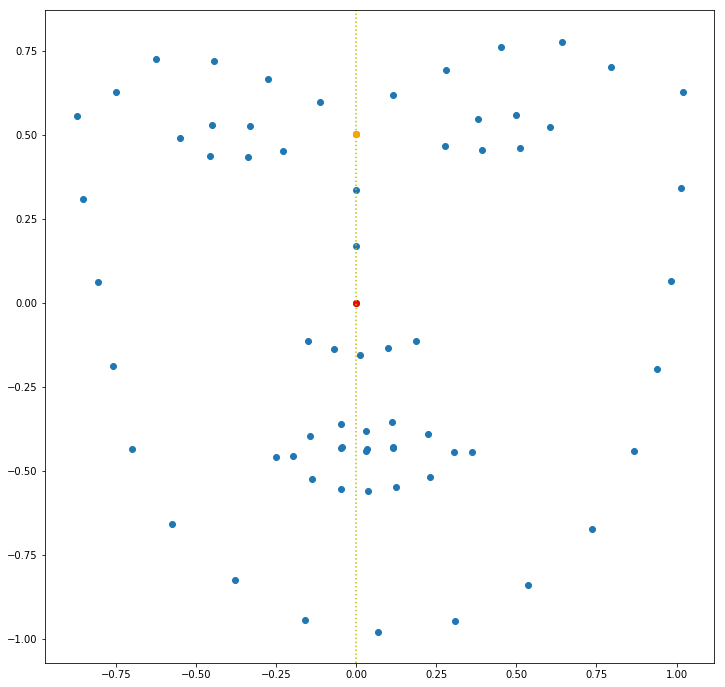
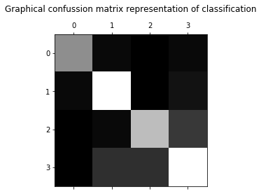

```python
import os
import sys
import math

import numpy as np
import pandas as pd
import cv2
import matplotlib.pyplot as plt
```


```python
ROOT_PATH = os.path.abspath('.\\')

print('Project directory path:', ROOT_PATH)


def get_path(rel_path):
    return os.path.join(ROOT_PATH, rel_path)
```

    Project directory path: D:\My Work\VR
    


```python
def bgr2rgb(bgr_img):
    return cv2.cvtColor(bgr_img, cv2.COLOR_BGR2RGB)
```


```python
face_image_path = get_path('trump-face2.png')

face_image = cv2.imread(face_image_path)
face_image_gray = cv2.cvtColor(face_image, cv2.COLOR_BGR2GRAY)

fig = plt.figure(figsize=(20, 8))
ax = fig.add_subplot(121)
ax.imshow(bgr2rgb(face_image))
ax = fig.add_subplot(122)
ax.imshow(face_image_gray, cmap='gray')
```


    <matplotlib.image.AxesImage at 0x26f66ad1780>





# Face detection


```python
def draw_faces(img, faces):
    img_copy = img.copy()
    for face in faces:
        x, y, h, w = face
        cv2.rectangle(img_copy, (x, y), (x+w, y+h), (0, 255, 255), 1)
    return img_copy
```


```python
face_detection_model = get_path('resources\\haarcascade_frontalface_alt2.xml')

face_detector = cv2.CascadeClassifier(face_detection_model)
faces = face_detector.detectMultiScale(face_image_gray)
print(faces)

fig = plt.figure(figsize=(20, 20))
ax = fig.add_subplot(111)
ax.imshow(bgr2rgb(draw_faces(face_image, faces)))
```

    [[ 59  64  98  98]
     [244  92 219 219]]
    


    <matplotlib.image.AxesImage at 0x26f667cd080>





```python
def get_biggest_face(faces):
    biggest_face = None
    narrowest_dim_val = -1
    for f in faces:
        _, _, h, w = f
        narrow_dim_val = h if h < w else w
        if narrow_dim_val >= narrowest_dim_val:
            narrowest_dim_val = narrow_dim_val
            biggest_face = f
    return f
```


```python
input_faces = np.array([get_biggest_face(faces)])
print(input_faces)

fig = plt.figure(figsize=(20, 20))
ax = fig.add_subplot(111)
ax.imshow(bgr2rgb(draw_faces(face_image, input_faces)))
```

    [[244  92 219 219]]
    


    <matplotlib.image.AxesImage at 0x26f66a48400>





# Face landmarks marking


```python
def read_landmarks_datafile(datafile: str, as_integer=False) -> np.ndarray:   
    sample_names = list()
    dataset = list()
    
    with open(datafile, 'r') as fstream:
        is_face_block = False
        
        face_landmarks = list()
        
        for line in fstream:
            line = line.strip()
            
            if line == '--face--':
                is_face_block = True
                sample_names.append(next(fstream))
                continue
                
            elif line == '--end--' and is_face_block:
                is_face_block = False
                dataset.append(np.array(face_landmarks))
                continue
            
            if is_face_block:
                str_values = line.split()
                tag_number, x, y = str_values
                if as_integer:
                    face_landmarks.append([int(tag_number), int(round(float(x))), int(round(float(y)))])
                else:
                    face_landmarks.append([float(tag_number), float(x), float(y)])

                
    return np.array(sample_names), np.array(dataset)
```


```python
landmarks_datafile = get_path('test-data.txt')
_, landmarks = read_landmarks_datafile(landmarks_datafile, as_integer=True)

print(landmarks[0])
```

    [[  0 260 175]
     [  1 263 200]
     [  2 269 226]
     [  3 274 252]
     [  4 282 278]
     [  5 296 300]
     [  6 317 317]
     [  7 340 328]
     [  8 364 331]
     [  9 389 327]
     [ 10 412 315]
     [ 11 432 297]
     [ 12 445 272]
     [ 13 452 246]
     [ 14 455 219]
     [ 15 457 190]
     [ 16 457 160]
     [ 17 272 167]
     [ 18 285 156]
     [ 19 304 156]
     [ 20 322 161]
     [ 21 339 167]
     [ 22 363 165]
     [ 23 379 156]
     [ 24 397 148]
     [ 25 417 146]
     [ 26 433 153]
     [ 27 351 177]
     [ 28 352 195]
     [ 29 352 212]
     [ 30 353 230]
     [ 31 338 242]
     [ 32 346 244]
     [ 33 355 246]
     [ 34 364 243]
     [ 35 373 241]
     [ 36 294 181]
     [ 37 304 176]
     [ 38 316 176]
     [ 39 327 183]
     [ 40 316 186]
     [ 41 304 186]
     [ 42 380 180]
     [ 43 390 171]
     [ 44 403 169]
     [ 45 414 172]
     [ 46 405 179]
     [ 47 392 181]
     [ 48 329 278]
     [ 49 339 272]
     [ 50 349 267]
     [ 51 358 269]
     [ 52 366 266]
     [ 53 378 269]
     [ 54 392 274]
     [ 55 379 283]
     [ 56 368 286]
     [ 57 359 288]
     [ 58 350 288]
     [ 59 340 285]
     [ 60 334 278]
     [ 61 350 275]
     [ 62 358 275]
     [ 63 366 274]
     [ 64 387 275]
     [ 65 367 274]
     [ 66 358 275]
     [ 67 350 274]]
    


```python
def draw_landmarks(img, landmarks):
    img_copy = img.copy()
    for index, x, y in landmarks:
        cv2.circle(img_copy, (x, y), 1, (0, 0, 255), 1)
    return img_copy
```


```python
fig = plt.figure(figsize=(20, 20))
ax = fig.add_subplot(111)
ax.imshow(bgr2rgb(draw_landmarks(draw_faces(face_image, input_faces), landmarks[0])))
```


    <matplotlib.image.AxesImage at 0x26f66bd8a90>


# Face landmarks normalisation


```python
fig = plt.figure(figsize=(12, 12))
ax = fig.add_subplot(111)
ax.scatter(landmarks[0, :, 1], -landmarks[0, :, 2])
```


    <matplotlib.collections.PathCollection at 0x26f66f2a320>





```python
landmarks_datafile = get_path('test-data.txt')
_, landmarks = read_landmarks_datafile(landmarks_datafile)
```


```python
def rebase_landmarks(landmarks: np.ndarray, base_point_idx: int):
    base_point = landmarks[base_point_idx, 1:].copy()
    landmarks[:, 1:] -= base_point
```


```python
landmarks_centered = landmarks.copy()
rebase_landmarks(landmarks_centered[0], 30)

fig = plt.figure(figsize=(12, 12))
ax = fig.add_subplot(111)
ax.scatter(landmarks_centered[0,:,1], -landmarks_centered[0,:,2])
ax.scatter(landmarks_centered[0,30,1], landmarks_centered[0,30,2], color='r')
ax.axvline(0, color='y', linestyle=':')
```


    <matplotlib.lines.Line2D at 0x26f669ecfd0>





```python
def normalise_landmarks_scale(landmarks: np.ndarray):
    # Get most deviated coordinate
    max_coord_dev = -1
    for x, y in landmarks[:, 1:]:
        x_dev = abs(x)
        y_dev = abs(y)
        coord_dev = x_dev if x_dev > y_dev else y_dev
        if coord_dev >= max_coord_dev:
            max_coord_dev = coord_dev
    
    # Normalise the scale of the landmarks coordinates
    landmarks[:, 1:] /= max_coord_dev
```


```python
landmarks_norm = landmarks_centered.copy()
normalise_landmarks_scale(landmarks_norm[0])

fig = plt.figure(figsize=(12, 12))
ax = fig.add_subplot(111)
ax.scatter(landmarks_norm[0,:,1], -landmarks_norm[0,:,2])
ax.scatter(landmarks_norm[0,30,1], landmarks_norm[0,30,2], color='r')
ax.axvline(0, color='y', linestyle=':')
```


    <matplotlib.lines.Line2D at 0x26f66f41cc0>





```python
def normalize_landmarks_tilt(landmarks: np.ndarray, tilt_point_idx):
    base_x, base_y = landmarks[tilt_point_idx, 1:]
    magnitude = math.sqrt(base_x**2 + base_y**2)
    cos_alpha = base_x / magnitude
    alpha = math.acos(cos_alpha)
    beta = alpha - math.pi*.5
    R = np.array([
        [math.cos(beta), -math.sin(beta)], 
        [math.sin(beta), math.cos(beta)]
    ])
    for i in range(landmarks.shape[0]):
        x, y = landmarks[i, 1:]
        xr = R[0, 0] * x + R[0, 1] * y
        yr = R[1, 0] * x + R[1, 1] * y
        landmarks[i, 1] = xr
        landmarks[i, 1] = xr
```


```python
landmarks_rotated = landmarks_norm.copy()
normalize_landmarks_tilt(landmarks_rotated[0], 27)

fig = plt.figure(figsize=(12, 12))
ax = fig.add_subplot(111)
ax.scatter(landmarks_rotated[0,:,1], -landmarks_rotated[0,:,2])
ax.scatter(landmarks_rotated[0,30,1], -landmarks_rotated[0,30,2], color='r')
ax.scatter(landmarks_rotated[0,27,1], -landmarks_rotated[0,27,2], color='orange')
ax.axvline(0, color='y', linestyle=':')
```


    <matplotlib.lines.Line2D at 0x26f668764e0>





### Face landmarks marked and normalised prior by c# program "VrFaceExpressDataGather"


```python
landmarks_datafile = get_path('test-data-norm.txt')
_, norm_landmarks = read_landmarks_datafile(landmarks_datafile)

fig = plt.figure(figsize=(12, 12))
ax = fig.add_subplot(111)
ax.scatter(norm_landmarks[0,:,1], -norm_landmarks[0,:,2])
ax.scatter(norm_landmarks[0,30,1], -norm_landmarks[0,30,2], color='r')
ax.scatter(norm_landmarks[0,27,1], -norm_landmarks[0,27,2], color='orange')
ax.axvline(0, color='y', linestyle=':')
```


    <matplotlib.lines.Line2D at 0x26f644d2f98>





# Preprocessed datasets merging


```python
def string2array(string: str, dtype: np.dtype) -> np.ndarray:
    return np.array(string.split(), dtype)


def string2image(string: str, dshape, dtype: np.dtype) -> np.ndarray:
    h, w = dshape
    image_dtype = np.uint8 if dtype is None else dtype
    image = np.reshape(string2array(string, image_dtype), (h, w))
    return image


def build_usage_offsets_dataframe(src_dataframe: pd.DataFrame) -> pd.DataFrame:
    offsets_df = pd.DataFrame(index=['From', 'To'], data=0,  columns=src_dataframe.Usage.unique())

    prev_idx = 0
    for col_name in offsets_df.columns[1:]:
        idx = (src_dataframe.Usage.values == col_name)[prev_idx:].argmax() + prev_idx
        offsets_df[col_name].From = idx
        prev_idx = idx

    start_idx = 0
    for col_name, next_col_name in zip(offsets_df.columns[:-1], offsets_df.columns[1:]):
        end_idx = (src_dataframe.Usage.values == next_col_name)[start_idx:].argmax() + start_idx 
        offsets_df[col_name].From = start_idx
        offsets_df[col_name].To = end_idx
        start_idx = end_idx

    offsets_df[offsets_df.columns[-1]][1] = len(src_dataframe)
    return offsets_df


def build_emotion_offsets_dataframe(src_dataframe: pd.DataFrame) -> pd.DataFrame:
    offsets_df = pd.DataFrame(index=['From', 'To'], data=0,  columns=src_dataframe.Emotion.unique())

    prev_idx = 0
    for col_name in offsets_df.columns[1:]:
        idx = (src_dataframe.Emotion.values == col_name)[prev_idx:].argmax() + prev_idx
        offsets_df[col_name].From = idx
        prev_idx = idx

    start_idx = 0
    for col_name, next_col_name in zip(offsets_df.columns[:-1], offsets_df.columns[1:]):
        end_idx = (src_dataframe.Emotion.values == next_col_name)[start_idx:].argmax() + start_idx 
        offsets_df[col_name].From = start_idx
        offsets_df[col_name].To = end_idx
        start_idx = end_idx

    offsets_df[offsets_df.columns[-1]][1] = len(src_dataframe)
    return offsets_df
```

### Data extracted and preprocessed by VRFaceExpressDataGatherer


```python
image_shape = (350, 350)

preproc_dataset_filepath = get_path('dataset\\faceexpress_dataset_v2.csv')

preproc_datasets_filepaths = [
    get_path('dataset\\faceexpress_dataset_v2_1.csv'),
    get_path('dataset\\faceexpress_dataset_v2_2.csv'),
]

preproc_df = pd.DataFrame(columns=['RefId', 'Emotion', 'LandmarksX', 'LandmarksY', 'Usage'])

for filepath in preproc_datasets_filepaths:
    df = pd.read_csv(filepath)
    print(filepath + ':', 'samples count:', len(df))
    preproc_df = pd.concat([preproc_df, df], copy=False)
       
preproc_df.reset_index(drop=True, inplace=True)
preproc_df.to_csv(preproc_dataset_filepath, index=False)

preproc_df
```

    D:\My Work\VR\dataset\faceexpress_dataset_v2_1.csv: samples count: 8751
    D:\My Work\VR\dataset\faceexpress_dataset_v2_2.csv: samples count: 3651
    


<div>
<style scoped>
    .dataframe tbody tr th:only-of-type {
        vertical-align: middle;
    }

    .dataframe tbody tr th {
        vertical-align: top;
    }

    .dataframe thead th {
        text-align: right;
    }
</style>
<table border="1" class="dataframe">
  <thead>
    <tr style="text-align: right;">
      <th></th>
      <th>RefId</th>
      <th>Emotion</th>
      <th>LandmarksX</th>
      <th>LandmarksY</th>
      <th>Usage</th>
    </tr>
  </thead>
  <tbody>
    <tr>
      <th>0</th>
      <td>0</td>
      <td>6</td>
      <td>-0.9817603 -0.9772285 -0.9443181 -0.8903714 -0...</td>
      <td>-0.6501337 -0.3752913 -0.08698966 0.19533 0.44...</td>
      <td>Training</td>
    </tr>
    <tr>
      <th>1</th>
      <td>1</td>
      <td>3</td>
      <td>-0.9761158 -0.9713687 -0.9505804 -0.8999547 -0...</td>
      <td>-0.4767559 -0.2261548 0.03220026 0.2868015 0.5...</td>
      <td>Training</td>
    </tr>
    <tr>
      <th>2</th>
      <td>2</td>
      <td>3</td>
      <td>-0.9644632 -0.961656 -0.9343616 -0.889282 -0.8...</td>
      <td>-0.5612193 -0.2988091 -0.04644889 0.2020933 0....</td>
      <td>Training</td>
    </tr>
    <tr>
      <th>3</th>
      <td>3</td>
      <td>3</td>
      <td>-0.9940907 -1 -0.9842424 -0.9551573 -0.8686826...</td>
      <td>-0.6020777 -0.3374976 -0.07179337 0.1813207 0....</td>
      <td>Training</td>
    </tr>
    <tr>
      <th>4</th>
      <td>4</td>
      <td>3</td>
      <td>-0.9501972 -0.925279 -0.8970452 -0.8700193 -0....</td>
      <td>-0.4587606 -0.2347537 -0.01561246 0.2090903 0....</td>
      <td>Training</td>
    </tr>
    <tr>
      <th>5</th>
      <td>5</td>
      <td>6</td>
      <td>-0.7948889 -0.7715917 -0.7080755 -0.6409862 -0...</td>
      <td>-0.3843004 -0.1605769 0.05942683 0.2734181 0.4...</td>
      <td>Training</td>
    </tr>
    <tr>
      <th>6</th>
      <td>6</td>
      <td>3</td>
      <td>-0.9756155 -0.9989714 -1 -0.961134 -0.86114 -0...</td>
      <td>-0.6020952 -0.3368705 -0.07637592 0.1705975 0....</td>
      <td>Training</td>
    </tr>
    <tr>
      <th>7</th>
      <td>7</td>
      <td>3</td>
      <td>-0.8948658 -0.8920694 -0.8786032 -0.849579 -0....</td>
      <td>-0.4740624 -0.2377992 -0.006833008 0.2318598 0...</td>
      <td>Training</td>
    </tr>
    <tr>
      <th>8</th>
      <td>8</td>
      <td>6</td>
      <td>-0.891812 -0.9070054 -0.8986869 -0.8519775 -0....</td>
      <td>-0.6109615 -0.3446218 -0.0776007 0.1771572 0.4...</td>
      <td>Training</td>
    </tr>
    <tr>
      <th>9</th>
      <td>9</td>
      <td>6</td>
      <td>-0.9676636 -0.9787258 -0.9916057 -1 -0.9443831...</td>
      <td>-0.4511919 -0.218403 -0.0008181374 0.2284453 0...</td>
      <td>Training</td>
    </tr>
    <tr>
      <th>10</th>
      <td>10</td>
      <td>3</td>
      <td>-0.9447595 -0.9679294 -1 -0.9916734 -0.9101051...</td>
      <td>-0.5996852 -0.3458149 -0.09624844 0.15766 0.39...</td>
      <td>Training</td>
    </tr>
    <tr>
      <th>11</th>
      <td>11</td>
      <td>6</td>
      <td>-0.9826037 -1 -0.9873047 -0.9618496 -0.8785983...</td>
      <td>-0.6255572 -0.35601 -0.09107201 0.1513518 0.37...</td>
      <td>Training</td>
    </tr>
    <tr>
      <th>12</th>
      <td>12</td>
      <td>6</td>
      <td>-0.9883924 -1 -0.9785193 -0.9279083 -0.8254812...</td>
      <td>-0.6134273 -0.3427089 -0.07287436 0.1811757 0....</td>
      <td>Training</td>
    </tr>
    <tr>
      <th>13</th>
      <td>13</td>
      <td>6</td>
      <td>-0.9356107 -0.9384367 -0.9261389 -0.8911784 -0...</td>
      <td>-0.4131876 -0.1651531 0.09102858 0.3413504 0.5...</td>
      <td>Training</td>
    </tr>
    <tr>
      <th>14</th>
      <td>14</td>
      <td>6</td>
      <td>-0.9901643 -1 -0.9887261 -0.9437262 -0.8535138...</td>
      <td>-0.634393 -0.3449829 -0.04881608 0.2390312 0.4...</td>
      <td>Training</td>
    </tr>
    <tr>
      <th>15</th>
      <td>15</td>
      <td>6</td>
      <td>-0.7294945 -0.7308269 -0.7094179 -0.6542111 -0...</td>
      <td>-0.4217611 -0.2087408 0.00529625 0.2241111 0.4...</td>
      <td>Training</td>
    </tr>
    <tr>
      <th>16</th>
      <td>16</td>
      <td>3</td>
      <td>-0.8664994 -0.8642517 -0.8431018 -0.7893753 -0...</td>
      <td>-0.5023101 -0.2529942 -0.006096103 0.230559 0....</td>
      <td>Training</td>
    </tr>
    <tr>
      <th>17</th>
      <td>17</td>
      <td>6</td>
      <td>-0.9558365 -0.9899532 -1 -0.9558895 -0.8454683...</td>
      <td>-0.6939108 -0.4316514 -0.1547725 0.1071825 0.3...</td>
      <td>Training</td>
    </tr>
    <tr>
      <th>18</th>
      <td>18</td>
      <td>3</td>
      <td>-0.9879509 -1 -0.9858618 -0.9337174 -0.8266768...</td>
      <td>-0.5931423 -0.3191538 -0.05526982 0.2098857 0....</td>
      <td>Training</td>
    </tr>
    <tr>
      <th>19</th>
      <td>19</td>
      <td>6</td>
      <td>-0.9879535 -0.9945922 -1 -0.9539194 -0.8490263...</td>
      <td>-0.4657817 -0.204241 0.04909147 0.2927896 0.50...</td>
      <td>Training</td>
    </tr>
    <tr>
      <th>20</th>
      <td>20</td>
      <td>6</td>
      <td>-1 -0.9735017 -0.932049 -0.8800108 -0.8027691 ...</td>
      <td>-0.3271439 -0.096081 0.130149 0.3492073 0.5671...</td>
      <td>Training</td>
    </tr>
    <tr>
      <th>21</th>
      <td>21</td>
      <td>6</td>
      <td>-0.8929872 -0.8707961 -0.8310592 -0.7670734 -0...</td>
      <td>-0.1114012 0.07958104 0.2711975 0.4510991 0.61...</td>
      <td>Training</td>
    </tr>
    <tr>
      <th>22</th>
      <td>22</td>
      <td>6</td>
      <td>-0.8199616 -0.8120564 -0.7785053 -0.7292743 -0...</td>
      <td>-0.417092 -0.2030347 0.02959248 0.2538806 0.45...</td>
      <td>Training</td>
    </tr>
    <tr>
      <th>23</th>
      <td>23</td>
      <td>6</td>
      <td>-0.6884845 -0.6802413 -0.6378636 -0.5661087 -0...</td>
      <td>-0.4829619 -0.2626493 -0.04028992 0.1715837 0....</td>
      <td>Training</td>
    </tr>
    <tr>
      <th>24</th>
      <td>24</td>
      <td>3</td>
      <td>-0.905981 -0.9004027 -0.8695316 -0.8048066 -0....</td>
      <td>-0.4087458 -0.1746923 0.06581048 0.2966336 0.5...</td>
      <td>Training</td>
    </tr>
    <tr>
      <th>25</th>
      <td>25</td>
      <td>6</td>
      <td>-0.76471 -0.756287 -0.727269 -0.6879152 -0.621...</td>
      <td>-0.3373891 -0.135588 0.07332334 0.2825419 0.48...</td>
      <td>Training</td>
    </tr>
    <tr>
      <th>26</th>
      <td>26</td>
      <td>6</td>
      <td>-0.7276747 -0.6986381 -0.6435051 -0.5720368 -0...</td>
      <td>-0.3852606 -0.1639475 0.05844573 0.2705087 0.4...</td>
      <td>Training</td>
    </tr>
    <tr>
      <th>27</th>
      <td>27</td>
      <td>3</td>
      <td>-0.9394906 -0.9689201 -1 -0.9961759 -0.9187944...</td>
      <td>-0.3519762 -0.1365363 0.07355279 0.3041728 0.5...</td>
      <td>Training</td>
    </tr>
    <tr>
      <th>28</th>
      <td>28</td>
      <td>3</td>
      <td>-0.998933 -1 -0.9846088 -0.9477599 -0.8617383 ...</td>
      <td>-0.6466984 -0.3589079 -0.07393605 0.2123085 0....</td>
      <td>Training</td>
    </tr>
    <tr>
      <th>29</th>
      <td>29</td>
      <td>3</td>
      <td>-0.8902757 -0.907072 -0.9211654 -0.9203306 -0....</td>
      <td>-0.3306831 -0.1192954 0.08909094 0.3049212 0.5...</td>
      <td>Training</td>
    </tr>
    <tr>
      <th>...</th>
      <td>...</td>
      <td>...</td>
      <td>...</td>
      <td>...</td>
      <td>...</td>
    </tr>
    <tr>
      <th>12372</th>
      <td>3740</td>
      <td>6</td>
      <td>-0.9765027 -1 -0.9991871 -0.9690267 -0.8933865...</td>
      <td>-0.5260152 -0.2985379 -0.06364518 0.1744452 0....</td>
      <td>Training</td>
    </tr>
    <tr>
      <th>12373</th>
      <td>3741</td>
      <td>3</td>
      <td>-0.9459909 -0.9869785 -1 -0.9758446 -0.8879405...</td>
      <td>-0.617193 -0.377044 -0.1232529 0.1265344 0.350...</td>
      <td>Training</td>
    </tr>
    <tr>
      <th>12374</th>
      <td>3742</td>
      <td>6</td>
      <td>-0.9611684 -0.9607692 -0.9184932 -0.8529838 -0...</td>
      <td>-0.5239537 -0.2584663 0.01256355 0.2645267 0.4...</td>
      <td>Training</td>
    </tr>
    <tr>
      <th>12375</th>
      <td>3743</td>
      <td>3</td>
      <td>-0.9636977 -0.9916601 -1 -0.9700676 -0.8722009...</td>
      <td>-0.551952 -0.3014005 -0.04976223 0.1990971 0.4...</td>
      <td>Training</td>
    </tr>
    <tr>
      <th>12376</th>
      <td>3744</td>
      <td>6</td>
      <td>-0.9415329 -0.9345298 -0.8901063 -0.818946 -0....</td>
      <td>-0.6504133 -0.3610563 -0.07098393 0.1979422 0....</td>
      <td>Training</td>
    </tr>
    <tr>
      <th>12377</th>
      <td>3745</td>
      <td>5</td>
      <td>-0.9833203 -1 -0.9777417 -0.9156746 -0.7874208...</td>
      <td>-0.6708035 -0.3765191 -0.09481069 0.1674018 0....</td>
      <td>Training</td>
    </tr>
    <tr>
      <th>12378</th>
      <td>3746</td>
      <td>6</td>
      <td>-0.9899769 -1 -0.9897232 -0.9338353 -0.8178459...</td>
      <td>-0.5546203 -0.2922353 -0.02237064 0.2284419 0....</td>
      <td>Training</td>
    </tr>
    <tr>
      <th>12379</th>
      <td>3747</td>
      <td>6</td>
      <td>-0.9454041 -0.9395724 -0.8861499 -0.8234555 -0...</td>
      <td>-0.6110557 -0.3537551 -0.09146889 0.1649883 0....</td>
      <td>Training</td>
    </tr>
    <tr>
      <th>12380</th>
      <td>3748</td>
      <td>3</td>
      <td>-1 -0.9784859 -0.9510231 -0.8976328 -0.7965066...</td>
      <td>-0.5484692 -0.2896667 -0.03892712 0.2077521 0....</td>
      <td>Training</td>
    </tr>
    <tr>
      <th>12381</th>
      <td>3749</td>
      <td>3</td>
      <td>-0.9124474 -0.8917391 -0.8430346 -0.7754195 -0...</td>
      <td>-0.5124999 -0.2481623 0.01136372 0.2631764 0.5...</td>
      <td>Training</td>
    </tr>
    <tr>
      <th>12382</th>
      <td>3750</td>
      <td>3</td>
      <td>-0.798412 -0.7758998 -0.7337569 -0.6845378 -0....</td>
      <td>-0.4462839 -0.2198927 0.01016253 0.2366113 0.4...</td>
      <td>Training</td>
    </tr>
    <tr>
      <th>12383</th>
      <td>3751</td>
      <td>3</td>
      <td>-0.994302 -1 -0.9877496 -0.9463373 -0.8494213 ...</td>
      <td>-0.5713667 -0.3186177 -0.05465566 0.1939489 0....</td>
      <td>Training</td>
    </tr>
    <tr>
      <th>12384</th>
      <td>3752</td>
      <td>3</td>
      <td>-1 -0.9969951 -0.989965 -0.9565214 -0.8625167 ...</td>
      <td>-0.6695299 -0.3774509 -0.09445047 0.1803661 0....</td>
      <td>Training</td>
    </tr>
    <tr>
      <th>12385</th>
      <td>3753</td>
      <td>3</td>
      <td>-0.8084589 -0.7847332 -0.7493847 -0.7190222 -0...</td>
      <td>-0.4850693 -0.2333547 0.0004168015 0.2338045 0...</td>
      <td>Training</td>
    </tr>
    <tr>
      <th>12386</th>
      <td>3754</td>
      <td>6</td>
      <td>-1 -0.9898541 -0.9468353 -0.8859487 -0.7943273...</td>
      <td>-0.5938105 -0.3096906 -0.040686 0.2182124 0.46...</td>
      <td>Training</td>
    </tr>
    <tr>
      <th>12387</th>
      <td>3755</td>
      <td>6</td>
      <td>-0.577059 -0.5573104 -0.4977945 -0.4239908 -0....</td>
      <td>-0.3494996 -0.1666866 0.01284947 0.1859354 0.3...</td>
      <td>Training</td>
    </tr>
    <tr>
      <th>12388</th>
      <td>3756</td>
      <td>3</td>
      <td>-0.8688646 -0.8461441 -0.782689 -0.7047274 -0....</td>
      <td>-0.6056241 -0.3454666 -0.09705956 0.1355304 0....</td>
      <td>Training</td>
    </tr>
    <tr>
      <th>12389</th>
      <td>3757</td>
      <td>6</td>
      <td>-0.721223 -0.6910604 -0.6248019 -0.5467083 -0....</td>
      <td>-0.4807512 -0.2537458 -0.03559493 0.1710842 0....</td>
      <td>Training</td>
    </tr>
    <tr>
      <th>12390</th>
      <td>3758</td>
      <td>6</td>
      <td>-0.9444138 -0.9534191 -0.9446607 -0.9160963 -0...</td>
      <td>-0.6763864 -0.3927681 -0.1120688 0.1509329 0.3...</td>
      <td>Training</td>
    </tr>
    <tr>
      <th>12391</th>
      <td>3759</td>
      <td>3</td>
      <td>-1 -0.9640341 -0.9108006 -0.8370592 -0.7183596...</td>
      <td>-0.5446943 -0.2962928 -0.05227414 0.1747325 0....</td>
      <td>Training</td>
    </tr>
    <tr>
      <th>12392</th>
      <td>3760</td>
      <td>3</td>
      <td>-0.6434349 -0.6191783 -0.5634427 -0.4939035 -0...</td>
      <td>-0.2006629 -0.03278949 0.1198697 0.2717417 0.4...</td>
      <td>Training</td>
    </tr>
    <tr>
      <th>12393</th>
      <td>3761</td>
      <td>6</td>
      <td>-0.9368893 -0.9708194 -0.9924491 -1 -0.954016 ...</td>
      <td>-0.5299545 -0.32974 -0.1105316 0.1097696 0.330...</td>
      <td>Training</td>
    </tr>
    <tr>
      <th>12394</th>
      <td>3762</td>
      <td>6</td>
      <td>-0.957346 -0.9878724 -1 -0.9830419 -0.9001654 ...</td>
      <td>-0.5171805 -0.2890268 -0.04409276 0.2013976 0....</td>
      <td>Training</td>
    </tr>
    <tr>
      <th>12395</th>
      <td>3763</td>
      <td>6</td>
      <td>-0.9649906 -0.9928046 -0.9923745 -0.9672403 -0...</td>
      <td>-0.5596275 -0.3098963 -0.04941912 0.2144317 0....</td>
      <td>Training</td>
    </tr>
    <tr>
      <th>12396</th>
      <td>3764</td>
      <td>3</td>
      <td>-0.9272284 -0.9741055 -1 -0.9877704 -0.8984996...</td>
      <td>-0.5597986 -0.3231883 -0.08254204 0.1490222 0....</td>
      <td>Training</td>
    </tr>
    <tr>
      <th>12397</th>
      <td>3765</td>
      <td>6</td>
      <td>-0.9119917 -0.8685862 -0.826173 -0.7794941 -0....</td>
      <td>-0.4883136 -0.2338241 -0.00922249 0.2123809 0....</td>
      <td>Training</td>
    </tr>
    <tr>
      <th>12398</th>
      <td>3766</td>
      <td>6</td>
      <td>-0.9303063 -0.9569501 -0.9659737 -0.9325235 -0...</td>
      <td>-0.5472003 -0.2874198 -0.02597737 0.2214962 0....</td>
      <td>Training</td>
    </tr>
    <tr>
      <th>12399</th>
      <td>3767</td>
      <td>6</td>
      <td>-0.9921672 -0.9951382 -1 -0.9693639 -0.8604792...</td>
      <td>-0.5831093 -0.3303324 -0.08557209 0.1522219 0....</td>
      <td>Training</td>
    </tr>
    <tr>
      <th>12400</th>
      <td>3768</td>
      <td>3</td>
      <td>-0.8236867 -0.8062493 -0.7830267 -0.7447761 -0...</td>
      <td>-0.4027557 -0.1671189 0.06007296 0.285259 0.50...</td>
      <td>Training</td>
    </tr>
    <tr>
      <th>12401</th>
      <td>3769</td>
      <td>6</td>
      <td>-0.990568 -0.9855475 -0.9631756 -0.9304909 -0....</td>
      <td>-0.4505962 -0.2043723 0.04250293 0.2747216 0.5...</td>
      <td>Training</td>
    </tr>
  </tbody>
</table>
<p>12402 rows × 5 columns</p>
</div>


### Emotions classes distribution in the dataset 


```python
preproc_df.groupby('Emotion').nunique()
```


<div>
<style scoped>
    .dataframe tbody tr th:only-of-type {
        vertical-align: middle;
    }

    .dataframe tbody tr th {
        vertical-align: top;
    }

    .dataframe thead th {
        text-align: right;
    }
</style>
<table border="1" class="dataframe">
  <thead>
    <tr style="text-align: right;">
      <th></th>
      <th>RefId</th>
      <th>Emotion</th>
      <th>LandmarksX</th>
      <th>LandmarksY</th>
      <th>Usage</th>
    </tr>
    <tr>
      <th>Emotion</th>
      <th></th>
      <th></th>
      <th></th>
      <th></th>
      <th></th>
    </tr>
  </thead>
  <tbody>
    <tr>
      <th>0</th>
      <td>221</td>
      <td>1</td>
      <td>221</td>
      <td>221</td>
      <td>1</td>
    </tr>
    <tr>
      <th>1</th>
      <td>20</td>
      <td>1</td>
      <td>20</td>
      <td>20</td>
      <td>1</td>
    </tr>
    <tr>
      <th>2</th>
      <td>12</td>
      <td>1</td>
      <td>12</td>
      <td>12</td>
      <td>1</td>
    </tr>
    <tr>
      <th>3</th>
      <td>4508</td>
      <td>1</td>
      <td>5175</td>
      <td>5175</td>
      <td>1</td>
    </tr>
    <tr>
      <th>4</th>
      <td>117</td>
      <td>1</td>
      <td>118</td>
      <td>118</td>
      <td>1</td>
    </tr>
    <tr>
      <th>5</th>
      <td>345</td>
      <td>1</td>
      <td>345</td>
      <td>345</td>
      <td>1</td>
    </tr>
    <tr>
      <th>6</th>
      <td>5535</td>
      <td>1</td>
      <td>6502</td>
      <td>6502</td>
      <td>1</td>
    </tr>
  </tbody>
</table>
</div>


### Dataset sorting by emotion class label


```python
to_shuffle = False
random_seed = 64646464

if to_shuffle:
    sorted_by_emo_preproc_df = preproc_df.sample(frac=1.0, random_state=random_seed)
    sorted_by_emo_preproc_df = sorted_by_emo_preproc_df.sort_values('Emotion').reset_index(drop=True)
else:
    sorted_by_emo_preproc_df = preproc_df.sort_values('Emotion').reset_index(drop=True)
    
sorted_by_emo_preproc_df
```


<div>
<style scoped>
    .dataframe tbody tr th:only-of-type {
        vertical-align: middle;
    }

    .dataframe tbody tr th {
        vertical-align: top;
    }

    .dataframe thead th {
        text-align: right;
    }
</style>
<table border="1" class="dataframe">
  <thead>
    <tr style="text-align: right;">
      <th></th>
      <th>RefId</th>
      <th>Emotion</th>
      <th>LandmarksX</th>
      <th>LandmarksY</th>
      <th>Usage</th>
    </tr>
  </thead>
  <tbody>
    <tr>
      <th>0</th>
      <td>2068</td>
      <td>0</td>
      <td>-0.9627703 -0.9710358 -0.9527595 -0.9058623 -0...</td>
      <td>-0.4731604 -0.2191867 0.03516011 0.2879407 0.5...</td>
      <td>Training</td>
    </tr>
    <tr>
      <th>1</th>
      <td>1496</td>
      <td>0</td>
      <td>-1 -0.9924394 -0.9667749 -0.9191696 -0.831744 ...</td>
      <td>-0.6857449 -0.3983679 -0.1327551 0.1382302 0.3...</td>
      <td>Training</td>
    </tr>
    <tr>
      <th>2</th>
      <td>3620</td>
      <td>0</td>
      <td>-0.8992684 -0.8755789 -0.8346221 -0.7639568 -0...</td>
      <td>-0.2213228 0.009404538 0.2310476 0.449347 0.65...</td>
      <td>Training</td>
    </tr>
    <tr>
      <th>3</th>
      <td>8553</td>
      <td>0</td>
      <td>-0.7619103 -0.7524947 -0.7047589 -0.639935 -0....</td>
      <td>-0.321264 -0.1092216 0.120695 0.3476833 0.5586...</td>
      <td>Training</td>
    </tr>
    <tr>
      <th>4</th>
      <td>5347</td>
      <td>0</td>
      <td>-0.9541487 -0.9820455 -1 -0.999381 -0.9508573 ...</td>
      <td>-0.397201 -0.187743 0.02691678 0.2385352 0.439...</td>
      <td>Training</td>
    </tr>
    <tr>
      <th>5</th>
      <td>4386</td>
      <td>0</td>
      <td>-0.7026041 -0.650904 -0.585924 -0.5241711 -0.4...</td>
      <td>0.0430217 0.187391 0.3383945 0.4942699 0.64849...</td>
      <td>Training</td>
    </tr>
    <tr>
      <th>6</th>
      <td>8550</td>
      <td>0</td>
      <td>-0.9174622 -0.8676175 -0.7832394 -0.6859902 -0...</td>
      <td>-0.5985135 -0.3374948 -0.08479345 0.147219 0.3...</td>
      <td>Training</td>
    </tr>
    <tr>
      <th>7</th>
      <td>2292</td>
      <td>0</td>
      <td>-1 -0.9988213 -0.9735387 -0.9350505 -0.8339408...</td>
      <td>-0.5190948 -0.2492016 0.01424758 0.2664935 0.4...</td>
      <td>Training</td>
    </tr>
    <tr>
      <th>8</th>
      <td>66</td>
      <td>0</td>
      <td>-1 -0.9846917 -0.9399452 -0.8891727 -0.787551 ...</td>
      <td>-0.50429 -0.2332332 0.02065657 0.2676314 0.497...</td>
      <td>Training</td>
    </tr>
    <tr>
      <th>9</th>
      <td>7649</td>
      <td>0</td>
      <td>-0.7378925 -0.7111963 -0.6606407 -0.6012172 -0...</td>
      <td>-0.1721081 0.0226271 0.2090582 0.396468 0.5773...</td>
      <td>Training</td>
    </tr>
    <tr>
      <th>10</th>
      <td>7648</td>
      <td>0</td>
      <td>-0.7566051 -0.7378207 -0.6933832 -0.6380727 -0...</td>
      <td>-0.3474932 -0.1443027 0.05650537 0.261405 0.46...</td>
      <td>Training</td>
    </tr>
    <tr>
      <th>11</th>
      <td>2738</td>
      <td>0</td>
      <td>-0.9575326 -0.9434307 -0.9051107 -0.8585395 -0...</td>
      <td>-0.6863704 -0.3876291 -0.1070063 0.166464 0.42...</td>
      <td>Training</td>
    </tr>
    <tr>
      <th>12</th>
      <td>8536</td>
      <td>0</td>
      <td>-0.9273083 -0.9079264 -0.8653899 -0.8140372 -0...</td>
      <td>-0.3262305 -0.08614767 0.1476397 0.3677208 0.5...</td>
      <td>Training</td>
    </tr>
    <tr>
      <th>13</th>
      <td>307</td>
      <td>0</td>
      <td>-0.98159 -0.9614943 -0.9367974 -0.8766912 -0.7...</td>
      <td>-0.6343257 -0.3564985 -0.08737922 0.1603666 0....</td>
      <td>Training</td>
    </tr>
    <tr>
      <th>14</th>
      <td>3684</td>
      <td>0</td>
      <td>-0.9730135 -0.9636795 -0.9527456 -0.9186109 -0...</td>
      <td>-0.4982733 -0.2351542 0.02354865 0.2803148 0.5...</td>
      <td>Training</td>
    </tr>
    <tr>
      <th>15</th>
      <td>7615</td>
      <td>0</td>
      <td>-1 -0.9584018 -0.8944426 -0.8234539 -0.7303153...</td>
      <td>-0.4473565 -0.1851769 0.05944736 0.2750358 0.4...</td>
      <td>Training</td>
    </tr>
    <tr>
      <th>16</th>
      <td>7614</td>
      <td>0</td>
      <td>-0.6153519 -0.5705537 -0.507994 -0.4211418 -0....</td>
      <td>-0.1683084 0.002217022 0.1651109 0.3226297 0.4...</td>
      <td>Training</td>
    </tr>
    <tr>
      <th>17</th>
      <td>2307</td>
      <td>0</td>
      <td>-0.9047928 -0.90204 -0.8727027 -0.8239268 -0.7...</td>
      <td>-0.5198031 -0.2611874 -0.003689412 0.2415103 0...</td>
      <td>Training</td>
    </tr>
    <tr>
      <th>18</th>
      <td>7081</td>
      <td>0</td>
      <td>-0.9714562 -0.950689 -0.9077331 -0.8474939 -0....</td>
      <td>-0.5330957 -0.2651342 -0.01495726 0.2174154 0....</td>
      <td>Training</td>
    </tr>
    <tr>
      <th>19</th>
      <td>4318</td>
      <td>0</td>
      <td>-0.9737201 -0.9953229 -1 -0.9586242 -0.837593 ...</td>
      <td>-0.7922144 -0.4941206 -0.1963924 0.07868021 0....</td>
      <td>Training</td>
    </tr>
    <tr>
      <th>20</th>
      <td>3743</td>
      <td>0</td>
      <td>-0.9901698 -1 -0.9860871 -0.9555694 -0.8826188...</td>
      <td>-0.5100607 -0.2620375 -0.008285215 0.2413793 0...</td>
      <td>Training</td>
    </tr>
    <tr>
      <th>21</th>
      <td>1126</td>
      <td>0</td>
      <td>-0.9802948 -0.9984909 -1 -0.9727268 -0.8717529...</td>
      <td>-0.4992721 -0.2640717 -0.01583987 0.2239953 0....</td>
      <td>Training</td>
    </tr>
    <tr>
      <th>22</th>
      <td>2979</td>
      <td>0</td>
      <td>-0.5600808 -0.5510257 -0.5132142 -0.444861 -0....</td>
      <td>-0.181832 -0.01053734 0.1579178 0.3198512 0.47...</td>
      <td>Training</td>
    </tr>
    <tr>
      <th>23</th>
      <td>6039</td>
      <td>0</td>
      <td>-1 -0.9907302 -0.9647986 -0.9237381 -0.8386084...</td>
      <td>-0.3685841 -0.1324038 0.09638031 0.3244837 0.5...</td>
      <td>Training</td>
    </tr>
    <tr>
      <th>24</th>
      <td>5360</td>
      <td>0</td>
      <td>-0.6751896 -0.6311955 -0.5585746 -0.466159 -0....</td>
      <td>-0.1776898 0.01286037 0.1973093 0.3781745 0.54...</td>
      <td>Training</td>
    </tr>
    <tr>
      <th>25</th>
      <td>1124</td>
      <td>0</td>
      <td>-0.6479094 -0.6496727 -0.6066597 -0.5539466 -0...</td>
      <td>-0.4332103 -0.2254438 -0.0134029 0.1938013 0.3...</td>
      <td>Training</td>
    </tr>
    <tr>
      <th>26</th>
      <td>7074</td>
      <td>0</td>
      <td>-1 -0.9769902 -0.9387178 -0.9017828 -0.8340126...</td>
      <td>-0.3183932 -0.09010854 0.1393621 0.3689851 0.5...</td>
      <td>Training</td>
    </tr>
    <tr>
      <th>27</th>
      <td>1436</td>
      <td>0</td>
      <td>-1 -0.9984349 -0.9712785 -0.9189697 -0.8032663...</td>
      <td>-0.7599101 -0.4477667 -0.147349 0.120109 0.370...</td>
      <td>Training</td>
    </tr>
    <tr>
      <th>28</th>
      <td>6027</td>
      <td>0</td>
      <td>-0.8623766 -0.8431212 -0.8012158 -0.7344272 -0...</td>
      <td>-0.3680124 -0.1587551 0.04524558 0.2485455 0.4...</td>
      <td>Training</td>
    </tr>
    <tr>
      <th>29</th>
      <td>1703</td>
      <td>0</td>
      <td>-0.9908038 -1 -0.9962677 -0.9777369 -0.8984366...</td>
      <td>-0.634636 -0.3671325 -0.1013685 0.1574978 0.39...</td>
      <td>Training</td>
    </tr>
    <tr>
      <th>...</th>
      <td>...</td>
      <td>...</td>
      <td>...</td>
      <td>...</td>
      <td>...</td>
    </tr>
    <tr>
      <th>12372</th>
      <td>5271</td>
      <td>6</td>
      <td>-0.9896774 -0.9576439 -0.9126848 -0.880325 -0....</td>
      <td>-0.3135523 -0.06747967 0.1823374 0.4230033 0.6...</td>
      <td>Training</td>
    </tr>
    <tr>
      <th>12373</th>
      <td>5270</td>
      <td>6</td>
      <td>-0.7688798 -0.7531607 -0.7010304 -0.6214359 -0...</td>
      <td>-0.345899 -0.113052 0.1127984 0.3277803 0.5257...</td>
      <td>Training</td>
    </tr>
    <tr>
      <th>12374</th>
      <td>5266</td>
      <td>6</td>
      <td>-1 -0.9824133 -0.9539057 -0.9027432 -0.8181022...</td>
      <td>-0.5200445 -0.252714 0.01595563 0.2661178 0.48...</td>
      <td>Training</td>
    </tr>
    <tr>
      <th>12375</th>
      <td>5264</td>
      <td>6</td>
      <td>-0.9752574 -0.9866149 -1 -0.9959294 -0.9219729...</td>
      <td>-0.6350118 -0.3721391 -0.1069864 0.1557665 0.3...</td>
      <td>Training</td>
    </tr>
    <tr>
      <th>12376</th>
      <td>5263</td>
      <td>6</td>
      <td>-0.602942 -0.5850936 -0.5374019 -0.4684916 -0....</td>
      <td>-0.2179543 -0.03983835 0.14013 0.316184 0.4809...</td>
      <td>Training</td>
    </tr>
    <tr>
      <th>12377</th>
      <td>5256</td>
      <td>6</td>
      <td>-0.5494701 -0.551473 -0.4974174 -0.4128804 -0....</td>
      <td>-0.1203736 0.04273786 0.21478 0.3806375 0.5424...</td>
      <td>Training</td>
    </tr>
    <tr>
      <th>12378</th>
      <td>5254</td>
      <td>6</td>
      <td>-0.9251716 -0.9168504 -0.8698851 -0.793489 -0....</td>
      <td>-0.4920372 -0.225146 0.03090547 0.2752302 0.50...</td>
      <td>Training</td>
    </tr>
    <tr>
      <th>12379</th>
      <td>5252</td>
      <td>6</td>
      <td>-0.7997975 -0.7686646 -0.7159513 -0.6428419 -0...</td>
      <td>-0.2654341 -0.05442036 0.1548433 0.3677719 0.5...</td>
      <td>Training</td>
    </tr>
    <tr>
      <th>12380</th>
      <td>5251</td>
      <td>6</td>
      <td>-0.8279317 -0.8275506 -0.8015065 -0.7565945 -0...</td>
      <td>-0.5057502 -0.2674033 -0.02742893 0.2107137 0....</td>
      <td>Training</td>
    </tr>
    <tr>
      <th>12381</th>
      <td>5250</td>
      <td>6</td>
      <td>-1 -0.9840256 -0.9565046 -0.9063848 -0.8032701...</td>
      <td>-0.6710399 -0.3900443 -0.1269649 0.1302932 0.3...</td>
      <td>Training</td>
    </tr>
    <tr>
      <th>12382</th>
      <td>5248</td>
      <td>6</td>
      <td>-0.9371578 -0.9443831 -0.9462829 -0.9291511 -0...</td>
      <td>-0.4621371 -0.2172165 0.02128791 0.255261 0.48...</td>
      <td>Training</td>
    </tr>
    <tr>
      <th>12383</th>
      <td>5247</td>
      <td>6</td>
      <td>-0.7000091 -0.6592311 -0.6006881 -0.5344875 -0...</td>
      <td>-0.375783 -0.1637272 0.03281415 0.2134544 0.40...</td>
      <td>Training</td>
    </tr>
    <tr>
      <th>12384</th>
      <td>5227</td>
      <td>6</td>
      <td>-0.7682538 -0.7500242 -0.7009583 -0.6272219 -0...</td>
      <td>-0.3942792 -0.166895 0.06155174 0.2759893 0.47...</td>
      <td>Training</td>
    </tr>
    <tr>
      <th>12385</th>
      <td>5246</td>
      <td>6</td>
      <td>-0.8399928 -0.8084337 -0.7518485 -0.6890149 -0...</td>
      <td>-0.6103245 -0.344183 -0.09092328 0.1419238 0.3...</td>
      <td>Training</td>
    </tr>
    <tr>
      <th>12386</th>
      <td>5244</td>
      <td>6</td>
      <td>-1 -0.9981216 -0.9885884 -0.9600979 -0.8705068...</td>
      <td>-0.5611029 -0.2878399 -0.0379483 0.2145911 0.4...</td>
      <td>Training</td>
    </tr>
    <tr>
      <th>12387</th>
      <td>5243</td>
      <td>6</td>
      <td>-0.9674034 -0.9469429 -0.8969772 -0.8357974 -0...</td>
      <td>-0.5783606 -0.3096572 -0.02867985 0.229964 0.4...</td>
      <td>Training</td>
    </tr>
    <tr>
      <th>12388</th>
      <td>5242</td>
      <td>6</td>
      <td>-0.8156929 -0.8041111 -0.7882818 -0.7563985 -0...</td>
      <td>-0.3657528 -0.1417123 0.08612324 0.3025382 0.5...</td>
      <td>Training</td>
    </tr>
    <tr>
      <th>12389</th>
      <td>5241</td>
      <td>6</td>
      <td>-0.6838294 -0.6655466 -0.6252716 -0.5604326 -0...</td>
      <td>-0.3142805 -0.1145288 0.08415967 0.2807323 0.4...</td>
      <td>Training</td>
    </tr>
    <tr>
      <th>12390</th>
      <td>5240</td>
      <td>6</td>
      <td>-0.9945896 -0.9955336 -0.9828573 -0.9432073 -0...</td>
      <td>-0.4960239 -0.245121 0.008849215 0.2525711 0.4...</td>
      <td>Training</td>
    </tr>
    <tr>
      <th>12391</th>
      <td>5239</td>
      <td>6</td>
      <td>-0.8777428 -0.8340554 -0.7587172 -0.6854604 -0...</td>
      <td>-0.3010292 -0.09287932 0.1080301 0.3030471 0.4...</td>
      <td>Training</td>
    </tr>
    <tr>
      <th>12392</th>
      <td>5236</td>
      <td>6</td>
      <td>-0.8528295 -0.8364876 -0.8127568 -0.7725855 -0...</td>
      <td>-0.4022779 -0.1703405 0.04459954 0.2711074 0.4...</td>
      <td>Training</td>
    </tr>
    <tr>
      <th>12393</th>
      <td>5235</td>
      <td>6</td>
      <td>-0.8971383 -0.8765987 -0.8383553 -0.7931641 -0...</td>
      <td>-0.5434969 -0.2917937 -0.04830472 0.1865344 0....</td>
      <td>Training</td>
    </tr>
    <tr>
      <th>12394</th>
      <td>5234</td>
      <td>6</td>
      <td>-0.5777312 -0.5650995 -0.5198762 -0.4486859 -0...</td>
      <td>-0.3980801 -0.2090484 -0.03774562 0.1303688 0....</td>
      <td>Training</td>
    </tr>
    <tr>
      <th>12395</th>
      <td>5233</td>
      <td>6</td>
      <td>-0.9392667 -0.9265317 -0.8798173 -0.8220156 -0...</td>
      <td>-0.8759123 -0.5640117 -0.2723736 0.004864606 0...</td>
      <td>Training</td>
    </tr>
    <tr>
      <th>12396</th>
      <td>5232</td>
      <td>6</td>
      <td>-0.9085678 -0.8773633 -0.8186568 -0.7486523 -0...</td>
      <td>-0.5755517 -0.3031638 -0.05162637 0.1858872 0....</td>
      <td>Training</td>
    </tr>
    <tr>
      <th>12397</th>
      <td>5231</td>
      <td>6</td>
      <td>-0.8984839 -0.8788101 -0.8404976 -0.7944902 -0...</td>
      <td>-0.5760235 -0.3182824 -0.07215069 0.1678502 0....</td>
      <td>Training</td>
    </tr>
    <tr>
      <th>12398</th>
      <td>5230</td>
      <td>6</td>
      <td>-0.834727 -0.808486 -0.7585852 -0.6986949 -0.6...</td>
      <td>-0.4747773 -0.2295956 0.007774289 0.2351798 0....</td>
      <td>Training</td>
    </tr>
    <tr>
      <th>12399</th>
      <td>5229</td>
      <td>6</td>
      <td>-0.884598 -0.8803805 -0.8723322 -0.8385196 -0....</td>
      <td>-0.4813081 -0.2289642 0.01584408 0.251055 0.48...</td>
      <td>Training</td>
    </tr>
    <tr>
      <th>12400</th>
      <td>5245</td>
      <td>6</td>
      <td>-0.851661 -0.821631 -0.7704772 -0.7210217 -0.6...</td>
      <td>-0.4567772 -0.2142294 0.02781216 0.258563 0.49...</td>
      <td>Training</td>
    </tr>
    <tr>
      <th>12401</th>
      <td>3769</td>
      <td>6</td>
      <td>-0.990568 -0.9855475 -0.9631756 -0.9304909 -0....</td>
      <td>-0.4505962 -0.2043723 0.04250293 0.2747216 0.5...</td>
      <td>Training</td>
    </tr>
  </tbody>
</table>
<p>12402 rows × 5 columns</p>
</div>


```python
emo_offsets_df = build_emotion_offsets_dataframe(sorted_by_emo_preproc_df)
emo_offsets_df                                    
```


<div>
<style scoped>
    .dataframe tbody tr th:only-of-type {
        vertical-align: middle;
    }

    .dataframe tbody tr th {
        vertical-align: top;
    }

    .dataframe thead th {
        text-align: right;
    }
</style>
<table border="1" class="dataframe">
  <thead>
    <tr style="text-align: right;">
      <th></th>
      <th>0</th>
      <th>1</th>
      <th>2</th>
      <th>3</th>
      <th>4</th>
      <th>5</th>
      <th>6</th>
    </tr>
  </thead>
  <tbody>
    <tr>
      <th>From</th>
      <td>0</td>
      <td>221</td>
      <td>241</td>
      <td>253</td>
      <td>5431</td>
      <td>5549</td>
      <td>5894</td>
    </tr>
    <tr>
      <th>To</th>
      <td>221</td>
      <td>241</td>
      <td>253</td>
      <td>5431</td>
      <td>5549</td>
      <td>5894</td>
      <td>12402</td>
    </tr>
  </tbody>
</table>
</div>


### Leave classes having the most significant number of samples.

<br> Most significant emotions datasets:
<br> 0 - Anger
<br> 3 - Happiness/joy
<br> 5 - Surprise
<br> 6 - Neutral


```python
significant_emo_preproc_df = pd.concat([
    sorted_by_emo_preproc_df[emo_offsets_df[0].From: emo_offsets_df[0].To],
    sorted_by_emo_preproc_df[emo_offsets_df[3].From: emo_offsets_df[3].To],
    sorted_by_emo_preproc_df[emo_offsets_df[5].From: emo_offsets_df[5].To],
    sorted_by_emo_preproc_df[emo_offsets_df[6].From: emo_offsets_df[6].To],
])
significant_emo_preproc_df
```


<div>
<style scoped>
    .dataframe tbody tr th:only-of-type {
        vertical-align: middle;
    }

    .dataframe tbody tr th {
        vertical-align: top;
    }

    .dataframe thead th {
        text-align: right;
    }
</style>
<table border="1" class="dataframe">
  <thead>
    <tr style="text-align: right;">
      <th></th>
      <th>RefId</th>
      <th>Emotion</th>
      <th>LandmarksX</th>
      <th>LandmarksY</th>
      <th>Usage</th>
    </tr>
  </thead>
  <tbody>
    <tr>
      <th>0</th>
      <td>2068</td>
      <td>0</td>
      <td>-0.9627703 -0.9710358 -0.9527595 -0.9058623 -0...</td>
      <td>-0.4731604 -0.2191867 0.03516011 0.2879407 0.5...</td>
      <td>Training</td>
    </tr>
    <tr>
      <th>1</th>
      <td>1496</td>
      <td>0</td>
      <td>-1 -0.9924394 -0.9667749 -0.9191696 -0.831744 ...</td>
      <td>-0.6857449 -0.3983679 -0.1327551 0.1382302 0.3...</td>
      <td>Training</td>
    </tr>
    <tr>
      <th>2</th>
      <td>3620</td>
      <td>0</td>
      <td>-0.8992684 -0.8755789 -0.8346221 -0.7639568 -0...</td>
      <td>-0.2213228 0.009404538 0.2310476 0.449347 0.65...</td>
      <td>Training</td>
    </tr>
    <tr>
      <th>3</th>
      <td>8553</td>
      <td>0</td>
      <td>-0.7619103 -0.7524947 -0.7047589 -0.639935 -0....</td>
      <td>-0.321264 -0.1092216 0.120695 0.3476833 0.5586...</td>
      <td>Training</td>
    </tr>
    <tr>
      <th>4</th>
      <td>5347</td>
      <td>0</td>
      <td>-0.9541487 -0.9820455 -1 -0.999381 -0.9508573 ...</td>
      <td>-0.397201 -0.187743 0.02691678 0.2385352 0.439...</td>
      <td>Training</td>
    </tr>
    <tr>
      <th>5</th>
      <td>4386</td>
      <td>0</td>
      <td>-0.7026041 -0.650904 -0.585924 -0.5241711 -0.4...</td>
      <td>0.0430217 0.187391 0.3383945 0.4942699 0.64849...</td>
      <td>Training</td>
    </tr>
    <tr>
      <th>6</th>
      <td>8550</td>
      <td>0</td>
      <td>-0.9174622 -0.8676175 -0.7832394 -0.6859902 -0...</td>
      <td>-0.5985135 -0.3374948 -0.08479345 0.147219 0.3...</td>
      <td>Training</td>
    </tr>
    <tr>
      <th>7</th>
      <td>2292</td>
      <td>0</td>
      <td>-1 -0.9988213 -0.9735387 -0.9350505 -0.8339408...</td>
      <td>-0.5190948 -0.2492016 0.01424758 0.2664935 0.4...</td>
      <td>Training</td>
    </tr>
    <tr>
      <th>8</th>
      <td>66</td>
      <td>0</td>
      <td>-1 -0.9846917 -0.9399452 -0.8891727 -0.787551 ...</td>
      <td>-0.50429 -0.2332332 0.02065657 0.2676314 0.497...</td>
      <td>Training</td>
    </tr>
    <tr>
      <th>9</th>
      <td>7649</td>
      <td>0</td>
      <td>-0.7378925 -0.7111963 -0.6606407 -0.6012172 -0...</td>
      <td>-0.1721081 0.0226271 0.2090582 0.396468 0.5773...</td>
      <td>Training</td>
    </tr>
    <tr>
      <th>10</th>
      <td>7648</td>
      <td>0</td>
      <td>-0.7566051 -0.7378207 -0.6933832 -0.6380727 -0...</td>
      <td>-0.3474932 -0.1443027 0.05650537 0.261405 0.46...</td>
      <td>Training</td>
    </tr>
    <tr>
      <th>11</th>
      <td>2738</td>
      <td>0</td>
      <td>-0.9575326 -0.9434307 -0.9051107 -0.8585395 -0...</td>
      <td>-0.6863704 -0.3876291 -0.1070063 0.166464 0.42...</td>
      <td>Training</td>
    </tr>
    <tr>
      <th>12</th>
      <td>8536</td>
      <td>0</td>
      <td>-0.9273083 -0.9079264 -0.8653899 -0.8140372 -0...</td>
      <td>-0.3262305 -0.08614767 0.1476397 0.3677208 0.5...</td>
      <td>Training</td>
    </tr>
    <tr>
      <th>13</th>
      <td>307</td>
      <td>0</td>
      <td>-0.98159 -0.9614943 -0.9367974 -0.8766912 -0.7...</td>
      <td>-0.6343257 -0.3564985 -0.08737922 0.1603666 0....</td>
      <td>Training</td>
    </tr>
    <tr>
      <th>14</th>
      <td>3684</td>
      <td>0</td>
      <td>-0.9730135 -0.9636795 -0.9527456 -0.9186109 -0...</td>
      <td>-0.4982733 -0.2351542 0.02354865 0.2803148 0.5...</td>
      <td>Training</td>
    </tr>
    <tr>
      <th>15</th>
      <td>7615</td>
      <td>0</td>
      <td>-1 -0.9584018 -0.8944426 -0.8234539 -0.7303153...</td>
      <td>-0.4473565 -0.1851769 0.05944736 0.2750358 0.4...</td>
      <td>Training</td>
    </tr>
    <tr>
      <th>16</th>
      <td>7614</td>
      <td>0</td>
      <td>-0.6153519 -0.5705537 -0.507994 -0.4211418 -0....</td>
      <td>-0.1683084 0.002217022 0.1651109 0.3226297 0.4...</td>
      <td>Training</td>
    </tr>
    <tr>
      <th>17</th>
      <td>2307</td>
      <td>0</td>
      <td>-0.9047928 -0.90204 -0.8727027 -0.8239268 -0.7...</td>
      <td>-0.5198031 -0.2611874 -0.003689412 0.2415103 0...</td>
      <td>Training</td>
    </tr>
    <tr>
      <th>18</th>
      <td>7081</td>
      <td>0</td>
      <td>-0.9714562 -0.950689 -0.9077331 -0.8474939 -0....</td>
      <td>-0.5330957 -0.2651342 -0.01495726 0.2174154 0....</td>
      <td>Training</td>
    </tr>
    <tr>
      <th>19</th>
      <td>4318</td>
      <td>0</td>
      <td>-0.9737201 -0.9953229 -1 -0.9586242 -0.837593 ...</td>
      <td>-0.7922144 -0.4941206 -0.1963924 0.07868021 0....</td>
      <td>Training</td>
    </tr>
    <tr>
      <th>20</th>
      <td>3743</td>
      <td>0</td>
      <td>-0.9901698 -1 -0.9860871 -0.9555694 -0.8826188...</td>
      <td>-0.5100607 -0.2620375 -0.008285215 0.2413793 0...</td>
      <td>Training</td>
    </tr>
    <tr>
      <th>21</th>
      <td>1126</td>
      <td>0</td>
      <td>-0.9802948 -0.9984909 -1 -0.9727268 -0.8717529...</td>
      <td>-0.4992721 -0.2640717 -0.01583987 0.2239953 0....</td>
      <td>Training</td>
    </tr>
    <tr>
      <th>22</th>
      <td>2979</td>
      <td>0</td>
      <td>-0.5600808 -0.5510257 -0.5132142 -0.444861 -0....</td>
      <td>-0.181832 -0.01053734 0.1579178 0.3198512 0.47...</td>
      <td>Training</td>
    </tr>
    <tr>
      <th>23</th>
      <td>6039</td>
      <td>0</td>
      <td>-1 -0.9907302 -0.9647986 -0.9237381 -0.8386084...</td>
      <td>-0.3685841 -0.1324038 0.09638031 0.3244837 0.5...</td>
      <td>Training</td>
    </tr>
    <tr>
      <th>24</th>
      <td>5360</td>
      <td>0</td>
      <td>-0.6751896 -0.6311955 -0.5585746 -0.466159 -0....</td>
      <td>-0.1776898 0.01286037 0.1973093 0.3781745 0.54...</td>
      <td>Training</td>
    </tr>
    <tr>
      <th>25</th>
      <td>1124</td>
      <td>0</td>
      <td>-0.6479094 -0.6496727 -0.6066597 -0.5539466 -0...</td>
      <td>-0.4332103 -0.2254438 -0.0134029 0.1938013 0.3...</td>
      <td>Training</td>
    </tr>
    <tr>
      <th>26</th>
      <td>7074</td>
      <td>0</td>
      <td>-1 -0.9769902 -0.9387178 -0.9017828 -0.8340126...</td>
      <td>-0.3183932 -0.09010854 0.1393621 0.3689851 0.5...</td>
      <td>Training</td>
    </tr>
    <tr>
      <th>27</th>
      <td>1436</td>
      <td>0</td>
      <td>-1 -0.9984349 -0.9712785 -0.9189697 -0.8032663...</td>
      <td>-0.7599101 -0.4477667 -0.147349 0.120109 0.370...</td>
      <td>Training</td>
    </tr>
    <tr>
      <th>28</th>
      <td>6027</td>
      <td>0</td>
      <td>-0.8623766 -0.8431212 -0.8012158 -0.7344272 -0...</td>
      <td>-0.3680124 -0.1587551 0.04524558 0.2485455 0.4...</td>
      <td>Training</td>
    </tr>
    <tr>
      <th>29</th>
      <td>1703</td>
      <td>0</td>
      <td>-0.9908038 -1 -0.9962677 -0.9777369 -0.8984366...</td>
      <td>-0.634636 -0.3671325 -0.1013685 0.1574978 0.39...</td>
      <td>Training</td>
    </tr>
    <tr>
      <th>...</th>
      <td>...</td>
      <td>...</td>
      <td>...</td>
      <td>...</td>
      <td>...</td>
    </tr>
    <tr>
      <th>12372</th>
      <td>5271</td>
      <td>6</td>
      <td>-0.9896774 -0.9576439 -0.9126848 -0.880325 -0....</td>
      <td>-0.3135523 -0.06747967 0.1823374 0.4230033 0.6...</td>
      <td>Training</td>
    </tr>
    <tr>
      <th>12373</th>
      <td>5270</td>
      <td>6</td>
      <td>-0.7688798 -0.7531607 -0.7010304 -0.6214359 -0...</td>
      <td>-0.345899 -0.113052 0.1127984 0.3277803 0.5257...</td>
      <td>Training</td>
    </tr>
    <tr>
      <th>12374</th>
      <td>5266</td>
      <td>6</td>
      <td>-1 -0.9824133 -0.9539057 -0.9027432 -0.8181022...</td>
      <td>-0.5200445 -0.252714 0.01595563 0.2661178 0.48...</td>
      <td>Training</td>
    </tr>
    <tr>
      <th>12375</th>
      <td>5264</td>
      <td>6</td>
      <td>-0.9752574 -0.9866149 -1 -0.9959294 -0.9219729...</td>
      <td>-0.6350118 -0.3721391 -0.1069864 0.1557665 0.3...</td>
      <td>Training</td>
    </tr>
    <tr>
      <th>12376</th>
      <td>5263</td>
      <td>6</td>
      <td>-0.602942 -0.5850936 -0.5374019 -0.4684916 -0....</td>
      <td>-0.2179543 -0.03983835 0.14013 0.316184 0.4809...</td>
      <td>Training</td>
    </tr>
    <tr>
      <th>12377</th>
      <td>5256</td>
      <td>6</td>
      <td>-0.5494701 -0.551473 -0.4974174 -0.4128804 -0....</td>
      <td>-0.1203736 0.04273786 0.21478 0.3806375 0.5424...</td>
      <td>Training</td>
    </tr>
    <tr>
      <th>12378</th>
      <td>5254</td>
      <td>6</td>
      <td>-0.9251716 -0.9168504 -0.8698851 -0.793489 -0....</td>
      <td>-0.4920372 -0.225146 0.03090547 0.2752302 0.50...</td>
      <td>Training</td>
    </tr>
    <tr>
      <th>12379</th>
      <td>5252</td>
      <td>6</td>
      <td>-0.7997975 -0.7686646 -0.7159513 -0.6428419 -0...</td>
      <td>-0.2654341 -0.05442036 0.1548433 0.3677719 0.5...</td>
      <td>Training</td>
    </tr>
    <tr>
      <th>12380</th>
      <td>5251</td>
      <td>6</td>
      <td>-0.8279317 -0.8275506 -0.8015065 -0.7565945 -0...</td>
      <td>-0.5057502 -0.2674033 -0.02742893 0.2107137 0....</td>
      <td>Training</td>
    </tr>
    <tr>
      <th>12381</th>
      <td>5250</td>
      <td>6</td>
      <td>-1 -0.9840256 -0.9565046 -0.9063848 -0.8032701...</td>
      <td>-0.6710399 -0.3900443 -0.1269649 0.1302932 0.3...</td>
      <td>Training</td>
    </tr>
    <tr>
      <th>12382</th>
      <td>5248</td>
      <td>6</td>
      <td>-0.9371578 -0.9443831 -0.9462829 -0.9291511 -0...</td>
      <td>-0.4621371 -0.2172165 0.02128791 0.255261 0.48...</td>
      <td>Training</td>
    </tr>
    <tr>
      <th>12383</th>
      <td>5247</td>
      <td>6</td>
      <td>-0.7000091 -0.6592311 -0.6006881 -0.5344875 -0...</td>
      <td>-0.375783 -0.1637272 0.03281415 0.2134544 0.40...</td>
      <td>Training</td>
    </tr>
    <tr>
      <th>12384</th>
      <td>5227</td>
      <td>6</td>
      <td>-0.7682538 -0.7500242 -0.7009583 -0.6272219 -0...</td>
      <td>-0.3942792 -0.166895 0.06155174 0.2759893 0.47...</td>
      <td>Training</td>
    </tr>
    <tr>
      <th>12385</th>
      <td>5246</td>
      <td>6</td>
      <td>-0.8399928 -0.8084337 -0.7518485 -0.6890149 -0...</td>
      <td>-0.6103245 -0.344183 -0.09092328 0.1419238 0.3...</td>
      <td>Training</td>
    </tr>
    <tr>
      <th>12386</th>
      <td>5244</td>
      <td>6</td>
      <td>-1 -0.9981216 -0.9885884 -0.9600979 -0.8705068...</td>
      <td>-0.5611029 -0.2878399 -0.0379483 0.2145911 0.4...</td>
      <td>Training</td>
    </tr>
    <tr>
      <th>12387</th>
      <td>5243</td>
      <td>6</td>
      <td>-0.9674034 -0.9469429 -0.8969772 -0.8357974 -0...</td>
      <td>-0.5783606 -0.3096572 -0.02867985 0.229964 0.4...</td>
      <td>Training</td>
    </tr>
    <tr>
      <th>12388</th>
      <td>5242</td>
      <td>6</td>
      <td>-0.8156929 -0.8041111 -0.7882818 -0.7563985 -0...</td>
      <td>-0.3657528 -0.1417123 0.08612324 0.3025382 0.5...</td>
      <td>Training</td>
    </tr>
    <tr>
      <th>12389</th>
      <td>5241</td>
      <td>6</td>
      <td>-0.6838294 -0.6655466 -0.6252716 -0.5604326 -0...</td>
      <td>-0.3142805 -0.1145288 0.08415967 0.2807323 0.4...</td>
      <td>Training</td>
    </tr>
    <tr>
      <th>12390</th>
      <td>5240</td>
      <td>6</td>
      <td>-0.9945896 -0.9955336 -0.9828573 -0.9432073 -0...</td>
      <td>-0.4960239 -0.245121 0.008849215 0.2525711 0.4...</td>
      <td>Training</td>
    </tr>
    <tr>
      <th>12391</th>
      <td>5239</td>
      <td>6</td>
      <td>-0.8777428 -0.8340554 -0.7587172 -0.6854604 -0...</td>
      <td>-0.3010292 -0.09287932 0.1080301 0.3030471 0.4...</td>
      <td>Training</td>
    </tr>
    <tr>
      <th>12392</th>
      <td>5236</td>
      <td>6</td>
      <td>-0.8528295 -0.8364876 -0.8127568 -0.7725855 -0...</td>
      <td>-0.4022779 -0.1703405 0.04459954 0.2711074 0.4...</td>
      <td>Training</td>
    </tr>
    <tr>
      <th>12393</th>
      <td>5235</td>
      <td>6</td>
      <td>-0.8971383 -0.8765987 -0.8383553 -0.7931641 -0...</td>
      <td>-0.5434969 -0.2917937 -0.04830472 0.1865344 0....</td>
      <td>Training</td>
    </tr>
    <tr>
      <th>12394</th>
      <td>5234</td>
      <td>6</td>
      <td>-0.5777312 -0.5650995 -0.5198762 -0.4486859 -0...</td>
      <td>-0.3980801 -0.2090484 -0.03774562 0.1303688 0....</td>
      <td>Training</td>
    </tr>
    <tr>
      <th>12395</th>
      <td>5233</td>
      <td>6</td>
      <td>-0.9392667 -0.9265317 -0.8798173 -0.8220156 -0...</td>
      <td>-0.8759123 -0.5640117 -0.2723736 0.004864606 0...</td>
      <td>Training</td>
    </tr>
    <tr>
      <th>12396</th>
      <td>5232</td>
      <td>6</td>
      <td>-0.9085678 -0.8773633 -0.8186568 -0.7486523 -0...</td>
      <td>-0.5755517 -0.3031638 -0.05162637 0.1858872 0....</td>
      <td>Training</td>
    </tr>
    <tr>
      <th>12397</th>
      <td>5231</td>
      <td>6</td>
      <td>-0.8984839 -0.8788101 -0.8404976 -0.7944902 -0...</td>
      <td>-0.5760235 -0.3182824 -0.07215069 0.1678502 0....</td>
      <td>Training</td>
    </tr>
    <tr>
      <th>12398</th>
      <td>5230</td>
      <td>6</td>
      <td>-0.834727 -0.808486 -0.7585852 -0.6986949 -0.6...</td>
      <td>-0.4747773 -0.2295956 0.007774289 0.2351798 0....</td>
      <td>Training</td>
    </tr>
    <tr>
      <th>12399</th>
      <td>5229</td>
      <td>6</td>
      <td>-0.884598 -0.8803805 -0.8723322 -0.8385196 -0....</td>
      <td>-0.4813081 -0.2289642 0.01584408 0.251055 0.48...</td>
      <td>Training</td>
    </tr>
    <tr>
      <th>12400</th>
      <td>5245</td>
      <td>6</td>
      <td>-0.851661 -0.821631 -0.7704772 -0.7210217 -0.6...</td>
      <td>-0.4567772 -0.2142294 0.02781216 0.258563 0.49...</td>
      <td>Training</td>
    </tr>
    <tr>
      <th>12401</th>
      <td>3769</td>
      <td>6</td>
      <td>-0.990568 -0.9855475 -0.9631756 -0.9304909 -0....</td>
      <td>-0.4505962 -0.2043723 0.04250293 0.2747216 0.5...</td>
      <td>Training</td>
    </tr>
  </tbody>
</table>
<p>12252 rows × 5 columns</p>
</div>


```python
significant_emo_preproc_df.groupby('Emotion').nunique()
```


<div>
<style scoped>
    .dataframe tbody tr th:only-of-type {
        vertical-align: middle;
    }

    .dataframe tbody tr th {
        vertical-align: top;
    }

    .dataframe thead th {
        text-align: right;
    }
</style>
<table border="1" class="dataframe">
  <thead>
    <tr style="text-align: right;">
      <th></th>
      <th>RefId</th>
      <th>Emotion</th>
      <th>LandmarksX</th>
      <th>LandmarksY</th>
      <th>Usage</th>
    </tr>
    <tr>
      <th>Emotion</th>
      <th></th>
      <th></th>
      <th></th>
      <th></th>
      <th></th>
    </tr>
  </thead>
  <tbody>
    <tr>
      <th>0</th>
      <td>221</td>
      <td>1</td>
      <td>221</td>
      <td>221</td>
      <td>1</td>
    </tr>
    <tr>
      <th>3</th>
      <td>4508</td>
      <td>1</td>
      <td>5175</td>
      <td>5175</td>
      <td>1</td>
    </tr>
    <tr>
      <th>5</th>
      <td>345</td>
      <td>1</td>
      <td>345</td>
      <td>345</td>
      <td>1</td>
    </tr>
    <tr>
      <th>6</th>
      <td>5535</td>
      <td>1</td>
      <td>6502</td>
      <td>6502</td>
      <td>1</td>
    </tr>
  </tbody>
</table>
</div>


```python
sig_emo_offsets_df = build_emotion_offsets_dataframe(significant_emo_preproc_df)
sig_emo_offsets_df
```


<div>
<style scoped>
    .dataframe tbody tr th:only-of-type {
        vertical-align: middle;
    }

    .dataframe tbody tr th {
        vertical-align: top;
    }

    .dataframe thead th {
        text-align: right;
    }
</style>
<table border="1" class="dataframe">
  <thead>
    <tr style="text-align: right;">
      <th></th>
      <th>0</th>
      <th>3</th>
      <th>5</th>
      <th>6</th>
    </tr>
  </thead>
  <tbody>
    <tr>
      <th>From</th>
      <td>0</td>
      <td>221</td>
      <td>5399</td>
      <td>5744</td>
    </tr>
    <tr>
      <th>To</th>
      <td>221</td>
      <td>5399</td>
      <td>5744</td>
      <td>12252</td>
    </tr>
  </tbody>
</table>
</div>


### Classes dataset sizes normalisation


```python
max_class_samples = 350


def normalise_samples_count(i):
    from_i = sig_emo_offsets_df[i].From
    to_i = sig_emo_offsets_df[i].To
    if to_i > max_class_samples: to_i = from_i + max_class_samples
    return significant_emo_preproc_df[from_i:to_i]


leveled_emo_preproc_df = pd.concat([
    normalise_samples_count(0),
    normalise_samples_count(3),
    normalise_samples_count(5),
    normalise_samples_count(6),
]).reset_index(drop=True)

leveled_emo_preproc_df.groupby('Emotion').nunique()
```


<div>
<style scoped>
    .dataframe tbody tr th:only-of-type {
        vertical-align: middle;
    }

    .dataframe tbody tr th {
        vertical-align: top;
    }

    .dataframe thead th {
        text-align: right;
    }
</style>
<table border="1" class="dataframe">
  <thead>
    <tr style="text-align: right;">
      <th></th>
      <th>RefId</th>
      <th>Emotion</th>
      <th>LandmarksX</th>
      <th>LandmarksY</th>
      <th>Usage</th>
    </tr>
    <tr>
      <th>Emotion</th>
      <th></th>
      <th></th>
      <th></th>
      <th></th>
      <th></th>
    </tr>
  </thead>
  <tbody>
    <tr>
      <th>0</th>
      <td>221</td>
      <td>1</td>
      <td>221</td>
      <td>221</td>
      <td>1</td>
    </tr>
    <tr>
      <th>3</th>
      <td>350</td>
      <td>1</td>
      <td>350</td>
      <td>350</td>
      <td>1</td>
    </tr>
    <tr>
      <th>5</th>
      <td>345</td>
      <td>1</td>
      <td>345</td>
      <td>345</td>
      <td>1</td>
    </tr>
    <tr>
      <th>6</th>
      <td>350</td>
      <td>1</td>
      <td>350</td>
      <td>350</td>
      <td>1</td>
    </tr>
  </tbody>
</table>
</div>


### Final dataset review


```python
preproc_df = leveled_emo_preproc_df
preproc_df
```


<div>
<style scoped>
    .dataframe tbody tr th:only-of-type {
        vertical-align: middle;
    }

    .dataframe tbody tr th {
        vertical-align: top;
    }

    .dataframe thead th {
        text-align: right;
    }
</style>
<table border="1" class="dataframe">
  <thead>
    <tr style="text-align: right;">
      <th></th>
      <th>RefId</th>
      <th>Emotion</th>
      <th>LandmarksX</th>
      <th>LandmarksY</th>
      <th>Usage</th>
    </tr>
  </thead>
  <tbody>
    <tr>
      <th>0</th>
      <td>2068</td>
      <td>0</td>
      <td>-0.9627703 -0.9710358 -0.9527595 -0.9058623 -0...</td>
      <td>-0.4731604 -0.2191867 0.03516011 0.2879407 0.5...</td>
      <td>Training</td>
    </tr>
    <tr>
      <th>1</th>
      <td>1496</td>
      <td>0</td>
      <td>-1 -0.9924394 -0.9667749 -0.9191696 -0.831744 ...</td>
      <td>-0.6857449 -0.3983679 -0.1327551 0.1382302 0.3...</td>
      <td>Training</td>
    </tr>
    <tr>
      <th>2</th>
      <td>3620</td>
      <td>0</td>
      <td>-0.8992684 -0.8755789 -0.8346221 -0.7639568 -0...</td>
      <td>-0.2213228 0.009404538 0.2310476 0.449347 0.65...</td>
      <td>Training</td>
    </tr>
    <tr>
      <th>3</th>
      <td>8553</td>
      <td>0</td>
      <td>-0.7619103 -0.7524947 -0.7047589 -0.639935 -0....</td>
      <td>-0.321264 -0.1092216 0.120695 0.3476833 0.5586...</td>
      <td>Training</td>
    </tr>
    <tr>
      <th>4</th>
      <td>5347</td>
      <td>0</td>
      <td>-0.9541487 -0.9820455 -1 -0.999381 -0.9508573 ...</td>
      <td>-0.397201 -0.187743 0.02691678 0.2385352 0.439...</td>
      <td>Training</td>
    </tr>
    <tr>
      <th>5</th>
      <td>4386</td>
      <td>0</td>
      <td>-0.7026041 -0.650904 -0.585924 -0.5241711 -0.4...</td>
      <td>0.0430217 0.187391 0.3383945 0.4942699 0.64849...</td>
      <td>Training</td>
    </tr>
    <tr>
      <th>6</th>
      <td>8550</td>
      <td>0</td>
      <td>-0.9174622 -0.8676175 -0.7832394 -0.6859902 -0...</td>
      <td>-0.5985135 -0.3374948 -0.08479345 0.147219 0.3...</td>
      <td>Training</td>
    </tr>
    <tr>
      <th>7</th>
      <td>2292</td>
      <td>0</td>
      <td>-1 -0.9988213 -0.9735387 -0.9350505 -0.8339408...</td>
      <td>-0.5190948 -0.2492016 0.01424758 0.2664935 0.4...</td>
      <td>Training</td>
    </tr>
    <tr>
      <th>8</th>
      <td>66</td>
      <td>0</td>
      <td>-1 -0.9846917 -0.9399452 -0.8891727 -0.787551 ...</td>
      <td>-0.50429 -0.2332332 0.02065657 0.2676314 0.497...</td>
      <td>Training</td>
    </tr>
    <tr>
      <th>9</th>
      <td>7649</td>
      <td>0</td>
      <td>-0.7378925 -0.7111963 -0.6606407 -0.6012172 -0...</td>
      <td>-0.1721081 0.0226271 0.2090582 0.396468 0.5773...</td>
      <td>Training</td>
    </tr>
    <tr>
      <th>10</th>
      <td>7648</td>
      <td>0</td>
      <td>-0.7566051 -0.7378207 -0.6933832 -0.6380727 -0...</td>
      <td>-0.3474932 -0.1443027 0.05650537 0.261405 0.46...</td>
      <td>Training</td>
    </tr>
    <tr>
      <th>11</th>
      <td>2738</td>
      <td>0</td>
      <td>-0.9575326 -0.9434307 -0.9051107 -0.8585395 -0...</td>
      <td>-0.6863704 -0.3876291 -0.1070063 0.166464 0.42...</td>
      <td>Training</td>
    </tr>
    <tr>
      <th>12</th>
      <td>8536</td>
      <td>0</td>
      <td>-0.9273083 -0.9079264 -0.8653899 -0.8140372 -0...</td>
      <td>-0.3262305 -0.08614767 0.1476397 0.3677208 0.5...</td>
      <td>Training</td>
    </tr>
    <tr>
      <th>13</th>
      <td>307</td>
      <td>0</td>
      <td>-0.98159 -0.9614943 -0.9367974 -0.8766912 -0.7...</td>
      <td>-0.6343257 -0.3564985 -0.08737922 0.1603666 0....</td>
      <td>Training</td>
    </tr>
    <tr>
      <th>14</th>
      <td>3684</td>
      <td>0</td>
      <td>-0.9730135 -0.9636795 -0.9527456 -0.9186109 -0...</td>
      <td>-0.4982733 -0.2351542 0.02354865 0.2803148 0.5...</td>
      <td>Training</td>
    </tr>
    <tr>
      <th>15</th>
      <td>7615</td>
      <td>0</td>
      <td>-1 -0.9584018 -0.8944426 -0.8234539 -0.7303153...</td>
      <td>-0.4473565 -0.1851769 0.05944736 0.2750358 0.4...</td>
      <td>Training</td>
    </tr>
    <tr>
      <th>16</th>
      <td>7614</td>
      <td>0</td>
      <td>-0.6153519 -0.5705537 -0.507994 -0.4211418 -0....</td>
      <td>-0.1683084 0.002217022 0.1651109 0.3226297 0.4...</td>
      <td>Training</td>
    </tr>
    <tr>
      <th>17</th>
      <td>2307</td>
      <td>0</td>
      <td>-0.9047928 -0.90204 -0.8727027 -0.8239268 -0.7...</td>
      <td>-0.5198031 -0.2611874 -0.003689412 0.2415103 0...</td>
      <td>Training</td>
    </tr>
    <tr>
      <th>18</th>
      <td>7081</td>
      <td>0</td>
      <td>-0.9714562 -0.950689 -0.9077331 -0.8474939 -0....</td>
      <td>-0.5330957 -0.2651342 -0.01495726 0.2174154 0....</td>
      <td>Training</td>
    </tr>
    <tr>
      <th>19</th>
      <td>4318</td>
      <td>0</td>
      <td>-0.9737201 -0.9953229 -1 -0.9586242 -0.837593 ...</td>
      <td>-0.7922144 -0.4941206 -0.1963924 0.07868021 0....</td>
      <td>Training</td>
    </tr>
    <tr>
      <th>20</th>
      <td>3743</td>
      <td>0</td>
      <td>-0.9901698 -1 -0.9860871 -0.9555694 -0.8826188...</td>
      <td>-0.5100607 -0.2620375 -0.008285215 0.2413793 0...</td>
      <td>Training</td>
    </tr>
    <tr>
      <th>21</th>
      <td>1126</td>
      <td>0</td>
      <td>-0.9802948 -0.9984909 -1 -0.9727268 -0.8717529...</td>
      <td>-0.4992721 -0.2640717 -0.01583987 0.2239953 0....</td>
      <td>Training</td>
    </tr>
    <tr>
      <th>22</th>
      <td>2979</td>
      <td>0</td>
      <td>-0.5600808 -0.5510257 -0.5132142 -0.444861 -0....</td>
      <td>-0.181832 -0.01053734 0.1579178 0.3198512 0.47...</td>
      <td>Training</td>
    </tr>
    <tr>
      <th>23</th>
      <td>6039</td>
      <td>0</td>
      <td>-1 -0.9907302 -0.9647986 -0.9237381 -0.8386084...</td>
      <td>-0.3685841 -0.1324038 0.09638031 0.3244837 0.5...</td>
      <td>Training</td>
    </tr>
    <tr>
      <th>24</th>
      <td>5360</td>
      <td>0</td>
      <td>-0.6751896 -0.6311955 -0.5585746 -0.466159 -0....</td>
      <td>-0.1776898 0.01286037 0.1973093 0.3781745 0.54...</td>
      <td>Training</td>
    </tr>
    <tr>
      <th>25</th>
      <td>1124</td>
      <td>0</td>
      <td>-0.6479094 -0.6496727 -0.6066597 -0.5539466 -0...</td>
      <td>-0.4332103 -0.2254438 -0.0134029 0.1938013 0.3...</td>
      <td>Training</td>
    </tr>
    <tr>
      <th>26</th>
      <td>7074</td>
      <td>0</td>
      <td>-1 -0.9769902 -0.9387178 -0.9017828 -0.8340126...</td>
      <td>-0.3183932 -0.09010854 0.1393621 0.3689851 0.5...</td>
      <td>Training</td>
    </tr>
    <tr>
      <th>27</th>
      <td>1436</td>
      <td>0</td>
      <td>-1 -0.9984349 -0.9712785 -0.9189697 -0.8032663...</td>
      <td>-0.7599101 -0.4477667 -0.147349 0.120109 0.370...</td>
      <td>Training</td>
    </tr>
    <tr>
      <th>28</th>
      <td>6027</td>
      <td>0</td>
      <td>-0.8623766 -0.8431212 -0.8012158 -0.7344272 -0...</td>
      <td>-0.3680124 -0.1587551 0.04524558 0.2485455 0.4...</td>
      <td>Training</td>
    </tr>
    <tr>
      <th>29</th>
      <td>1703</td>
      <td>0</td>
      <td>-0.9908038 -1 -0.9962677 -0.9777369 -0.8984366...</td>
      <td>-0.634636 -0.3671325 -0.1013685 0.1574978 0.39...</td>
      <td>Training</td>
    </tr>
    <tr>
      <th>...</th>
      <td>...</td>
      <td>...</td>
      <td>...</td>
      <td>...</td>
      <td>...</td>
    </tr>
    <tr>
      <th>1241</th>
      <td>3754</td>
      <td>6</td>
      <td>-1 -0.9898541 -0.9468353 -0.8859487 -0.7943273...</td>
      <td>-0.5938105 -0.3096906 -0.040686 0.2182124 0.46...</td>
      <td>Training</td>
    </tr>
    <tr>
      <th>1242</th>
      <td>8083</td>
      <td>6</td>
      <td>-0.9880926 -1 -0.9940571 -0.9762036 -0.9026368...</td>
      <td>-0.4992979 -0.247646 -0.006352446 0.2328433 0....</td>
      <td>Training</td>
    </tr>
    <tr>
      <th>1243</th>
      <td>3755</td>
      <td>6</td>
      <td>-0.577059 -0.5573104 -0.4977945 -0.4239908 -0....</td>
      <td>-0.3494996 -0.1666866 0.01284947 0.1859354 0.3...</td>
      <td>Training</td>
    </tr>
    <tr>
      <th>1244</th>
      <td>3757</td>
      <td>6</td>
      <td>-0.721223 -0.6910604 -0.6248019 -0.5467083 -0....</td>
      <td>-0.4807512 -0.2537458 -0.03559493 0.1710842 0....</td>
      <td>Training</td>
    </tr>
    <tr>
      <th>1245</th>
      <td>3758</td>
      <td>6</td>
      <td>-0.9444138 -0.9534191 -0.9446607 -0.9160963 -0...</td>
      <td>-0.6763864 -0.3927681 -0.1120688 0.1509329 0.3...</td>
      <td>Training</td>
    </tr>
    <tr>
      <th>1246</th>
      <td>8080</td>
      <td>6</td>
      <td>-0.9256424 -0.9727718 -1 -0.9910157 -0.9081187...</td>
      <td>-0.6169461 -0.3804594 -0.1411015 0.09649872 0....</td>
      <td>Training</td>
    </tr>
    <tr>
      <th>1247</th>
      <td>8087</td>
      <td>6</td>
      <td>-1 -0.9943009 -0.96755 -0.9312401 -0.8516455 -...</td>
      <td>-0.3905678 -0.1511734 0.09222401 0.3298539 0.5...</td>
      <td>Training</td>
    </tr>
    <tr>
      <th>1248</th>
      <td>3698</td>
      <td>6</td>
      <td>-0.9913974 -1 -0.9839574 -0.9308105 -0.830228 ...</td>
      <td>-0.5803654 -0.2975878 -0.02717865 0.2337864 0....</td>
      <td>Training</td>
    </tr>
    <tr>
      <th>1249</th>
      <td>3696</td>
      <td>6</td>
      <td>-0.9050599 -0.8965319 -0.8537658 -0.8051845 -0...</td>
      <td>-0.5323201 -0.2704771 -0.02216905 0.2232595 0....</td>
      <td>Training</td>
    </tr>
    <tr>
      <th>1250</th>
      <td>8122</td>
      <td>6</td>
      <td>-0.9325884 -0.9042965 -0.8527623 -0.7806159 -0...</td>
      <td>-0.5342551 -0.2588786 -0.006325373 0.237976 0....</td>
      <td>Training</td>
    </tr>
    <tr>
      <th>1251</th>
      <td>8179</td>
      <td>6</td>
      <td>-0.8332133 -0.8052365 -0.7487651 -0.6784982 -0...</td>
      <td>-0.291765 -0.08666413 0.1123279 0.2990935 0.47...</td>
      <td>Training</td>
    </tr>
    <tr>
      <th>1252</th>
      <td>3645</td>
      <td>6</td>
      <td>-0.9871811 -0.989824 -1 -0.9865181 -0.9140024 ...</td>
      <td>-0.4439702 -0.2119969 0.01647734 0.247417 0.46...</td>
      <td>Training</td>
    </tr>
    <tr>
      <th>1253</th>
      <td>3646</td>
      <td>6</td>
      <td>-1 -0.9941706 -0.9783885 -0.9490103 -0.8829193...</td>
      <td>-0.4940343 -0.2515984 0.005324998 0.2424222 0....</td>
      <td>Training</td>
    </tr>
    <tr>
      <th>1254</th>
      <td>8178</td>
      <td>6</td>
      <td>-0.9601451 -0.9951904 -1 -0.9760576 -0.8875268...</td>
      <td>-0.5535412 -0.2978433 -0.0512502 0.1878706 0.4...</td>
      <td>Training</td>
    </tr>
    <tr>
      <th>1255</th>
      <td>3647</td>
      <td>6</td>
      <td>-1 -0.9962571 -0.9718634 -0.9422863 -0.884818 ...</td>
      <td>-0.5753147 -0.3085514 -0.05287745 0.205856 0.4...</td>
      <td>Training</td>
    </tr>
    <tr>
      <th>1256</th>
      <td>3648</td>
      <td>6</td>
      <td>-0.7592514 -0.7575119 -0.7141802 -0.6452835 -0...</td>
      <td>-0.6226554 -0.3825119 -0.1490591 0.06807202 0....</td>
      <td>Training</td>
    </tr>
    <tr>
      <th>1257</th>
      <td>8181</td>
      <td>6</td>
      <td>-0.9629773 -0.9917036 -1 -0.9746622 -0.8981126...</td>
      <td>-0.4664322 -0.2333338 -0.00126082 0.230844 0.4...</td>
      <td>Training</td>
    </tr>
    <tr>
      <th>1258</th>
      <td>3649</td>
      <td>6</td>
      <td>-0.5917398 -0.5772153 -0.529695 -0.4551502 -0....</td>
      <td>-0.2852628 -0.1158913 0.05031178 0.2107063 0.3...</td>
      <td>Training</td>
    </tr>
    <tr>
      <th>1259</th>
      <td>3650</td>
      <td>6</td>
      <td>-1 -0.9898365 -0.9509592 -0.9019215 -0.7984157...</td>
      <td>-0.6602014 -0.373045 -0.08784928 0.1744052 0.4...</td>
      <td>Training</td>
    </tr>
    <tr>
      <th>1260</th>
      <td>3651</td>
      <td>6</td>
      <td>-0.915399 -0.9212804 -0.9082937 -0.8722723 -0....</td>
      <td>-0.524403 -0.257369 0.01169777 0.2660127 0.502...</td>
      <td>Training</td>
    </tr>
    <tr>
      <th>1261</th>
      <td>3652</td>
      <td>6</td>
      <td>-0.8434395 -0.8284296 -0.8020453 -0.771597 -0....</td>
      <td>-0.1165675 0.07827195 0.2729781 0.4729192 0.67...</td>
      <td>Training</td>
    </tr>
    <tr>
      <th>1262</th>
      <td>3653</td>
      <td>6</td>
      <td>-0.981553 -0.9815431 -0.9666709 -0.9511895 -0....</td>
      <td>-0.3474343 -0.1026681 0.1328681 0.3687277 0.60...</td>
      <td>Training</td>
    </tr>
    <tr>
      <th>1263</th>
      <td>8170</td>
      <td>6</td>
      <td>-0.9406739 -0.9337223 -0.8877857 -0.8341382 -0...</td>
      <td>-0.384206 -0.1647598 0.05535346 0.2586875 0.45...</td>
      <td>Training</td>
    </tr>
    <tr>
      <th>1264</th>
      <td>3661</td>
      <td>6</td>
      <td>-0.9821795 -0.9507093 -0.8959667 -0.8302151 -0...</td>
      <td>-0.4827661 -0.2109814 0.04210788 0.2867719 0.5...</td>
      <td>Training</td>
    </tr>
    <tr>
      <th>1265</th>
      <td>8177</td>
      <td>6</td>
      <td>-0.9258302 -0.9306949 -0.8964973 -0.8527973 -0...</td>
      <td>-0.391976 -0.1793035 0.03130389 0.2427137 0.45...</td>
      <td>Training</td>
    </tr>
    <tr>
      <th>1266</th>
      <td>3662</td>
      <td>6</td>
      <td>-0.9006524 -0.8815146 -0.8465969 -0.7974845 -0...</td>
      <td>-0.5102822 -0.2649134 -0.03389245 0.2105932 0....</td>
      <td>Training</td>
    </tr>
    <tr>
      <th>1267</th>
      <td>3643</td>
      <td>6</td>
      <td>-1 -0.9901525 -0.9739647 -0.9516718 -0.8820502...</td>
      <td>-0.4065968 -0.152449 0.09278478 0.338609 0.577...</td>
      <td>Training</td>
    </tr>
    <tr>
      <th>1268</th>
      <td>3640</td>
      <td>6</td>
      <td>-0.9616434 -0.9440736 -0.9040901 -0.8415849 -0...</td>
      <td>-0.535178 -0.2763103 -0.01957829 0.218141 0.44...</td>
      <td>Training</td>
    </tr>
    <tr>
      <th>1269</th>
      <td>8202</td>
      <td>6</td>
      <td>-1 -0.9784954 -0.9264168 -0.8542944 -0.738566 ...</td>
      <td>-0.6147175 -0.3432973 -0.07426745 0.1760168 0....</td>
      <td>Training</td>
    </tr>
    <tr>
      <th>1270</th>
      <td>3623</td>
      <td>6</td>
      <td>-0.9985695 -1 -0.98449 -0.9524291 -0.8798664 -...</td>
      <td>-0.6485029 -0.3652255 -0.07835338 0.179662 0.4...</td>
      <td>Training</td>
    </tr>
  </tbody>
</table>
<p>1271 rows × 5 columns</p>
</div>


```python
train_data_frac = .90

n_samples = len(preproc_df)

train_range_from = 0
train_range_to = int(round(n_samples * train_data_frac))

test_range_from = train_range_to
test_range_to = n_samples

print('all samples:', n_samples)
print('training samples:', train_range_to-train_range_from)
print('testing samples:', test_range_to-test_range_from)


# max seed is 4294967295
random_seed = 2576764617

to_shuffle = True

if to_shuffle:
    preproc_df = preproc_df.sample(frac=1.0, random_state=random_seed)

preproc_df[train_range_from:train_range_to] = preproc_df[train_range_from:train_range_to].assign(Usage='Training')

preproc_df[test_range_from:test_range_to] = preproc_df[test_range_from:test_range_to].assign(Usage='Testing')

preproc_df = preproc_df.reset_index(drop=True)
```

    all samples: 1271
    training samples: 1144
    testing samples: 127
    


```python
preproc_dataset_ranges_df = build_usage_offsets_dataframe(preproc_df)

preproc_dataset_ranges_df
```


<div>
<style scoped>
    .dataframe tbody tr th:only-of-type {
        vertical-align: middle;
    }

    .dataframe tbody tr th {
        vertical-align: top;
    }

    .dataframe thead th {
        text-align: right;
    }
</style>
<table border="1" class="dataframe">
  <thead>
    <tr style="text-align: right;">
      <th></th>
      <th>Training</th>
      <th>Testing</th>
    </tr>
  </thead>
  <tbody>
    <tr>
      <th>From</th>
      <td>0</td>
      <td>1144</td>
    </tr>
    <tr>
      <th>To</th>
      <td>1144</td>
      <td>1271</td>
    </tr>
  </tbody>
</table>
</div>


# SVM Classifier


```python
def merge_two_arrays(n: int, array_one: np.ndarray, array_two: np.ndarray) -> np.ndarray:
    merged_array = np.empty(n*2, dtype=array_one.dtype)
    for i in range(n):
        j = i * 2
        merged_array[j] = array_one[i]
        merged_array[j+1] = array_two[i]
    return merged_array
```

### Training and testing data preparation


```python
train_range_from = preproc_dataset_ranges_df.Training.From
train_range_to = preproc_dataset_ranges_df.Training.To

train_labels = preproc_df.Emotion[train_range_from:train_range_to].astype(np.int64).values

print('training labels size:', train_labels.shape)
print()

landmarks_df = preproc_df.LandmarksX[train_range_from:train_range_to].map(
    lambda s: string2array(s, np.float32)).combine(
    preproc_df.LandmarksY[train_range_from:train_range_to].map(
    lambda s: string2array(s, np.float32)), (lambda a1, a2: merge_two_arrays(a1.size, a1, a2)))

train_data = np.array(np.vstack(landmarks_df.values))

print('training data shape:', train_data.shape)
```

    training labels size: (1144,)
    
    training data shape: (1144, 136)
    


```python
test_range_from = preproc_dataset_ranges_df.Testing.From
test_range_to = preproc_dataset_ranges_df.Testing.To

test_labels = preproc_df.Emotion[test_range_from:test_range_to].values

landmarks_df = preproc_df.LandmarksX[test_range_from:test_range_to].map(
    lambda s: string2array(s, np.float32)).combine(
    preproc_df.LandmarksY[test_range_from:test_range_to].map(
    lambda s: string2array(s, np.float32)), (lambda a1, a2: merge_two_arrays(a1.size, a1, a2)))

test_data = np.vstack(landmarks_df.values)

print('testing labels size:', test_labels.size)
print('testing data shape:', test_data.shape)
```

    testing labels size: 127
    testing data shape: (127, 136)
    

### Model loading or training


```python
svm_model_filepath: str = get_path('resources\\faceexpress_v5.dat')
# svm_model_filepath: str = ''  # to train new model, uncomment this line, pass new filepath and set `load_model` to False.  
load_model = True

if svm_model_filepath is not None and len(svm_model_filepath) > 0:

    if load_model:
        svm = cv2.ml.SVM_load(svm_model_filepath)
        
    else:
        svm = cv2.ml.SVM_create()
        svm.setC(2.67)
        svm.setGamma(5.383)
        svm.setType(cv2.ml.SVM_C_SVC)
        svm.setKernel(cv2.ml.SVM_LINEAR)

        svm.train(train_data, cv2.ml.ROW_SAMPLE, train_labels)
        svm.save(svm_model_savepath)
```

### Model testing and evaluation


```python
_, predictions = svm.predict(test_data)

pred_comp_df = pd.DataFrame(
    data=np.hstack((np.expand_dims(test_labels, 1), predictions)),
    columns=['Target', 'Prediction'], dtype=np.int)

pred_comp_matches_df = pred_comp_df.Target.eq(pred_comp_df.Prediction)
pred_comp_matches_df.name = 'Match'
pred_comp_df = pd.concat([pred_comp_df, pred_comp_matches_df], axis=1)

n_matches = pred_comp_df.Match.where(pred_comp_df.Match).count()
print(n_matches, len(pred_comp_df))
success_rate = n_matches / len(pred_comp_df)
print('success rate:', success_rate)

pred_comp_df.head(20)
```

    93 127
    success rate: 0.7322834645669292
    


<div>
<style scoped>
    .dataframe tbody tr th:only-of-type {
        vertical-align: middle;
    }

    .dataframe tbody tr th {
        vertical-align: top;
    }

    .dataframe thead th {
        text-align: right;
    }
</style>
<table border="1" class="dataframe">
  <thead>
    <tr style="text-align: right;">
      <th></th>
      <th>Target</th>
      <th>Prediction</th>
      <th>Match</th>
    </tr>
  </thead>
  <tbody>
    <tr>
      <th>0</th>
      <td>3</td>
      <td>3</td>
      <td>True</td>
    </tr>
    <tr>
      <th>1</th>
      <td>3</td>
      <td>3</td>
      <td>True</td>
    </tr>
    <tr>
      <th>2</th>
      <td>6</td>
      <td>3</td>
      <td>False</td>
    </tr>
    <tr>
      <th>3</th>
      <td>0</td>
      <td>0</td>
      <td>True</td>
    </tr>
    <tr>
      <th>4</th>
      <td>0</td>
      <td>0</td>
      <td>True</td>
    </tr>
    <tr>
      <th>5</th>
      <td>6</td>
      <td>5</td>
      <td>False</td>
    </tr>
    <tr>
      <th>6</th>
      <td>6</td>
      <td>3</td>
      <td>False</td>
    </tr>
    <tr>
      <th>7</th>
      <td>6</td>
      <td>5</td>
      <td>False</td>
    </tr>
    <tr>
      <th>8</th>
      <td>6</td>
      <td>6</td>
      <td>True</td>
    </tr>
    <tr>
      <th>9</th>
      <td>5</td>
      <td>5</td>
      <td>True</td>
    </tr>
    <tr>
      <th>10</th>
      <td>6</td>
      <td>6</td>
      <td>True</td>
    </tr>
    <tr>
      <th>11</th>
      <td>3</td>
      <td>3</td>
      <td>True</td>
    </tr>
    <tr>
      <th>12</th>
      <td>3</td>
      <td>3</td>
      <td>True</td>
    </tr>
    <tr>
      <th>13</th>
      <td>6</td>
      <td>3</td>
      <td>False</td>
    </tr>
    <tr>
      <th>14</th>
      <td>6</td>
      <td>6</td>
      <td>True</td>
    </tr>
    <tr>
      <th>15</th>
      <td>6</td>
      <td>6</td>
      <td>True</td>
    </tr>
    <tr>
      <th>16</th>
      <td>0</td>
      <td>0</td>
      <td>True</td>
    </tr>
    <tr>
      <th>17</th>
      <td>5</td>
      <td>6</td>
      <td>False</td>
    </tr>
    <tr>
      <th>18</th>
      <td>5</td>
      <td>6</td>
      <td>False</td>
    </tr>
    <tr>
      <th>19</th>
      <td>0</td>
      <td>0</td>
      <td>True</td>
    </tr>
  </tbody>
</table>
</div>


```python
from sklearn.metrics import confusion_matrix


confusion_mat = confusion_matrix(pred_comp_df.Target.values, pred_comp_df.Prediction.values, labels=[0, 3, 5, 6])
print('Numerical confussion matrix representation of classification:\n')
print(confusion_mat)

fig = plt.figure()
ax = fig.add_subplot(111)
ax.matshow(confusion_mat, cmap='gray')
ax.set_title('Graphical confussion matrix representation of classification\n')
plt.show()
```

    Numerical confussion matrix representation of classification:
    
    [[16  2  1  2]
     [ 2 28  1  3]
     [ 1  2 21  7]
     [ 1  6  6 28]]
    




